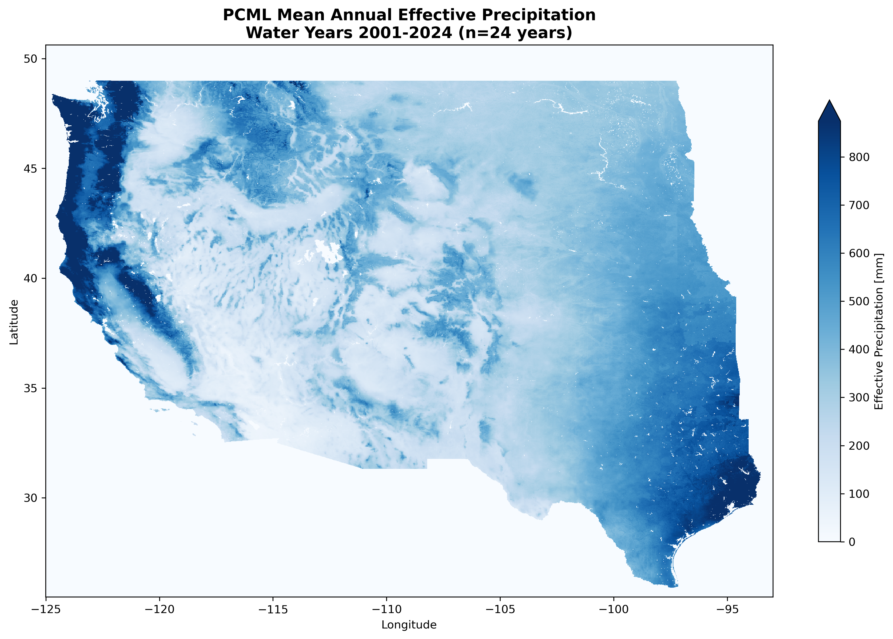
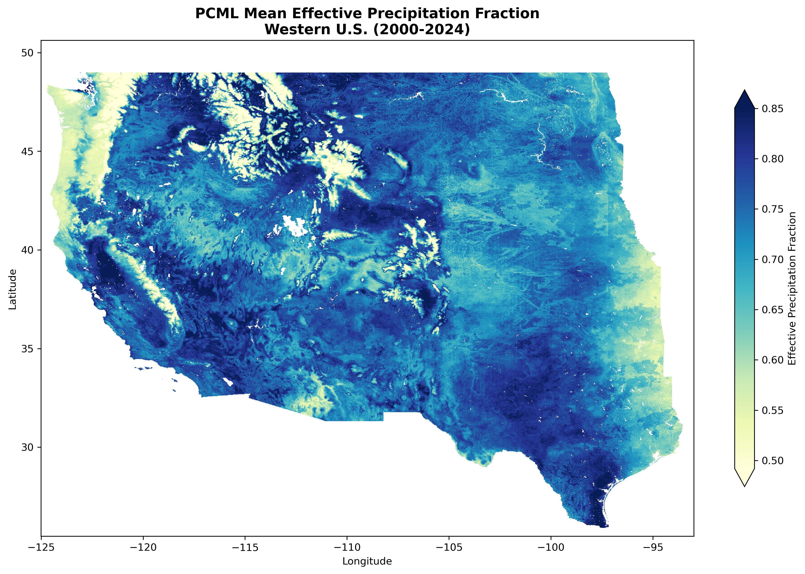

# Examples

## Example 1: ERA5-Land for South America

Calculate effective precipitation for a large river basin using ERA5-Land monthly data.

**Python:**

```python
from pycropwat import EffectivePrecipitation

ep = EffectivePrecipitation(
    asset_id='ECMWF/ERA5_LAND/MONTHLY_AGGR',
    precip_band='total_precipitation_sum',
    gee_geometry_asset='projects/my-project/assets/amazon_basin',
    start_year=2010,
    end_year=2023,
    precip_scale_factor=1000  # ERA5 precipitation is in meters
)

results = ep.process(
    output_dir='./amazon_effective_precip',
    n_workers=8
)
```

**CLI:**

```bash
pycropwat process \
    --asset ECMWF/ERA5_LAND/MONTHLY_AGGR \
    --band total_precipitation_sum \
    --gee-geometry projects/my-project/assets/amazon_basin \
    --start-year 2010 \
    --end-year 2023 \
    --scale-factor 1000 \
    --workers 8 \
    --output ./amazon_effective_precip
```

## Example 2: TerraClimate Long-term Analysis

Process 40+ years of TerraClimate data for drought analysis.

**Python:**

```python
from pycropwat import EffectivePrecipitation

ep = EffectivePrecipitation(
    asset_id='IDAHO_EPSCOR/TERRACLIMATE',
    precip_band='pr',
    geometry_path='western_us.geojson',
    start_year=1980,
    end_year=2023
    # No scale_factor needed - TerraClimate is already in mm
)

# Process only growing season months
results = ep.process(
    output_dir='./terraclimate_growing_season',
    n_workers=4,
    months=[4, 5, 6, 7, 8, 9, 10]  # April-October
)
```

**CLI:**

```bash
pycropwat process \
    --asset IDAHO_EPSCOR/TERRACLIMATE \
    --band pr \
    --geometry western_us.geojson \
    --start-year 1980 \
    --end-year 2023 \
    --months 4 5 6 7 8 9 10 \
    --workers 4 \
    --output ./terraclimate_growing_season
```

## Example 3: High-Resolution Custom Output

Generate 1km resolution outputs from ERA5-Land.

**Python:**

```python
from pycropwat import EffectivePrecipitation

ep = EffectivePrecipitation(
    asset_id='ECMWF/ERA5_LAND/MONTHLY_AGGR',
    precip_band='total_precipitation_sum',
    geometry_path='small_watershed.geojson',
    start_year=2020,
    end_year=2023,
    scale=1000,  # 1 km resolution
    precip_scale_factor=1000
)

results = ep.process(output_dir='./high_res_outputs', n_workers=4)
```

**CLI:**

```bash
pycropwat process \
    --asset ECMWF/ERA5_LAND/MONTHLY_AGGR \
    --band total_precipitation_sum \
    --geometry small_watershed.geojson \
    --start-year 2020 \
    --end-year 2023 \
    --scale 1000 \
    --scale-factor 1000 \
    --output ./high_res_outputs
```

## Example 4: CHIRPS for Africa

Use CHIRPS daily data for African agriculture analysis.

**Python:**

```python
from pycropwat import EffectivePrecipitation

ep = EffectivePrecipitation(
    asset_id='UCSB-CHG/CHIRPS/DAILY',
    precip_band='precipitation',
    gee_geometry_asset='projects/my-project/assets/africa_croplands',
    start_year=2015,
    end_year=2023
)

results = ep.process(
    output_dir='./africa_chirps_outputs',
    n_workers=8,
    months=[3, 4, 5, 6, 7, 8, 9, 10]  # Growing season
)
```

**CLI:**

```bash
pycropwat process \
    --asset UCSB-CHG/CHIRPS/DAILY \
    --band precipitation \
    --gee-geometry projects/my-project/assets/africa_croplands \
    --start-year 2015 \
    --end-year 2023 \
    --months 3 4 5 6 7 8 9 10 \
    --workers 8 \
    --output ./africa_chirps_outputs
```

!!! note
    Daily CHIRPS data is automatically summed to monthly totals.

## Example 5: Using Different Peff Methods

Compare different effective precipitation methods.

**Python:**

```python
from pycropwat import EffectivePrecipitation
from pycropwat.methods import (
    cropwat_effective_precip,
    fao_aglw_effective_precip,
    fixed_percentage_effective_precip,
    dependable_rainfall_effective_precip
)
import numpy as np

# Direct calculation with numpy arrays
precip = np.array([50, 100, 150, 200, 250, 300])

print("Monthly Precip:", precip)
print("CROPWAT:", cropwat_effective_precip(precip))
print("FAO/AGLW:", fao_aglw_effective_precip(precip))
print("Fixed 80%:", fixed_percentage_effective_precip(precip, 0.8))
print("Depend 75%:", dependable_rainfall_effective_precip(precip, 0.75))
```

**CLI:**

```bash
# CROPWAT method
pycropwat process --asset IDAHO_EPSCOR/TERRACLIMATE --band pr \
    --geometry roi.geojson --start-year 2015 --end-year 2020 \
    --method cropwat --output ./output_cropwat

# FAO/AGLW method
pycropwat process --asset IDAHO_EPSCOR/TERRACLIMATE --band pr \
    --geometry roi.geojson --start-year 2015 --end-year 2020 \
    --method fao_aglw --output ./output_fao

# Fixed percentage (80%)
pycropwat process --asset IDAHO_EPSCOR/TERRACLIMATE --band pr \
    --geometry roi.geojson --start-year 2015 --end-year 2020 \
    --method fixed_percentage --percentage 0.8 --output ./output_fixed

# Dependable rainfall (80% probability)
pycropwat process --asset IDAHO_EPSCOR/TERRACLIMATE --band pr \
    --geometry roi.geojson --start-year 2015 --end-year 2020 \
    --method dependable_rainfall --probability 0.8 --output ./output_depend
```

## Example 6: Temporal Aggregation

Aggregate monthly data into seasonal, annual, and climatology products.

**Python:**

```python
from pycropwat.analysis import TemporalAggregator

agg = TemporalAggregator('./outputs')

# Annual totals for each year
for year in range(2010, 2024):
    agg.annual_aggregate(
        year=year,
        method='sum',
        output_path=f'./annual/annual_{year}.tif'
    )

# Seasonal aggregations
for year in range(2010, 2024):
    for season in ['DJF', 'MAM', 'JJA', 'SON']:
        agg.seasonal_aggregate(
            year=year,
            season=season,
            method='sum',
            output_path=f'./seasonal/{season}_{year}.tif'
        )

# Growing season - Northern Hemisphere (April-October)
for year in range(2010, 2024):
    agg.growing_season_aggregate(
        year=year,
        start_month=4,
        end_month=10,
        method='sum',
        output_path=f'./growing/growing_{year}.tif'
    )

# Growing season - Southern Hemisphere (October-March, cross-year)
# When start_month > end_month, automatically spans two calendar years
for year in range(2010, 2023):  # End at 2023 since we need data from year+1
    agg.growing_season_aggregate(
        year=year,
        start_month=10,  # October
        end_month=3,     # March (of year+1)
        method='sum',
        output_path=f'./growing/growing_{year}_{year+1}.tif'
    )

# 30-year climatology (long-term monthly means)
climatology = agg.climatology(
    start_year=1990,
    end_year=2020,
    method='mean',
    output_dir='./climatology/'
)
```

**CLI:**

```bash
# Annual total
pycropwat aggregate --input ./outputs --type annual \
    --year 2020 --output ./annual_2020.tif

# Summer (JJA) aggregate
pycropwat aggregate --input ./outputs --type seasonal \
    --year 2020 --season JJA --output ./summer_2020.tif

# Growing season (April-October)
pycropwat aggregate --input ./outputs --type growing-season \
    --year 2020 --start-month 4 --end-month 10 \
    --output ./growing_2020.tif

# 30-year climatology
pycropwat aggregate --input ./outputs --type climatology \
    --start-year 1990 --end-year 2020 --output ./climatology/
```

## Example 7: Statistical Analysis

Perform anomaly detection, trend analysis, and zonal statistics.

**Python:**

```python
from pycropwat.analysis import TemporalAggregator, StatisticalAnalyzer

agg = TemporalAggregator('./outputs')
stats = StatisticalAnalyzer(agg)

# Percent anomaly for June 2023 relative to 1990-2020 climatology
anomaly = stats.calculate_anomaly(
    year=2023,
    month=6,
    clim_start=1990,
    clim_end=2020,
    anomaly_type='percent',
    output_path='./anomaly_2023_06.tif'
)

# Standardized anomaly (z-score)
anomaly_std = stats.calculate_anomaly(
    year=2023,
    month=6,
    clim_start=1990,
    clim_end=2020,
    anomaly_type='standardized',
    output_path='./anomaly_std_2023_06.tif'
)

# Linear trend analysis (2000-2020)
trend = stats.calculate_trend(
    start_year=2000,
    end_year=2020,
    method='linear',
    output_dir='./trend_linear/'
)
print(f"Trend outputs: slope, intercept, r_squared, p_value")

# Theil-Sen trend with Mann-Kendall test
trend_sen = stats.calculate_trend(
    start_year=2000,
    end_year=2020,
    method='sen',
    output_dir='./trend_sen/'
)

# Zonal statistics by administrative region
zonal_df = stats.zonal_statistics(
    zones_path='./admin_regions.shp',
    start_year=2010,
    end_year=2020,
    stats=['mean', 'sum', 'min', 'max', 'std'],
    output_path='./zonal_stats.csv'
)
print(zonal_df.head())
```

**CLI:**

```bash
# Percent anomaly
pycropwat analyze anomaly --input ./outputs \
    --year 2023 --month 6 \
    --clim-start 1990 --clim-end 2020 \
    --anomaly-type percent \
    --output ./anomaly_2023_06.tif

# Theil-Sen trend analysis
pycropwat analyze trend --input ./outputs \
    --start-year 2000 --end-year 2020 \
    --trend-method sen \
    --output ./trend/

# Zonal statistics
pycropwat analyze zonal --input ./outputs \
    --zones ./admin_regions.shp \
    --start-year 2010 --end-year 2020 \
    --output ./zonal_stats.csv
```

## Example 8: Export to Different Formats

Export data to NetCDF and Cloud-Optimized GeoTIFF.

**Python:**

```python
from pycropwat.analysis import export_to_netcdf, export_to_cog
from pathlib import Path

# Export all monthly data to a single NetCDF file
export_to_netcdf(
    input_dir='./outputs',
    output_path='./effective_precip.nc',
    variable='effective_precip',
    pattern='effective_precip_[0-9]*.tif',  # Excludes fraction files
    compression=True
)

# Batch convert to Cloud-Optimized GeoTIFFs (excludes fraction files)
output_cog_dir = Path('./cogs')
output_cog_dir.mkdir(exist_ok=True)

for tif in Path('./outputs').glob('effective_precip_[0-9]*.tif'):
    export_to_cog(
        input_path=str(tif),
        output_path=str(output_cog_dir / tif.name)
    )
```

**CLI:**

```bash
# Export to NetCDF
pycropwat export netcdf --input ./outputs --output ./effective_precip.nc

# Convert single file to COG
pycropwat export cog \
    --input ./outputs/effective_precip_2020_06.tif \
    --output ./cogs/effective_precip_2020_06.tif

# Batch convert with shell loop (excludes fraction files)
mkdir -p ./cogs
for f in ./outputs/effective_precip_[0-9]*.tif; do
    pycropwat export cog --input "$f" --output "./cogs/$(basename $f)"
done
```

## Example 9: Visualization

Create static plots and interactive maps.

**Python:**

```python
from pycropwat.analysis import Visualizer

viz = Visualizer('./outputs')

# Time series plot
fig = viz.plot_time_series(
    start_year=2000,
    end_year=2023,
    stat='mean',
    title='Mean Effective Precipitation (2000-2023)',
    figsize=(14, 6),
    output_path='./timeseries.png'
)

# Monthly climatology bar chart
fig = viz.plot_monthly_climatology(
    start_year=2000,
    end_year=2023,
    stat='mean',
    title='Monthly Climatology (2000-2023)',
    output_path='./climatology.png'
)

# Single month raster map
fig = viz.plot_raster(
    year=2020,
    month=6,
    cmap='YlGnBu',
    vmin=0,
    vmax=150,
    title='Effective Precipitation - June 2020',
    output_path='./map_2020_06.png'
)

# Interactive map (requires: pip install leafmap)
viz.plot_interactive_map(
    year=2020,
    month=6,
    cmap='YlGnBu',
    opacity=0.7,
    basemap='OpenStreetMap',
    output_path='./interactive_map.html'
)

# Anomaly map from GeoTIFF (diverging colormap, centered at 100%)
fig = viz.plot_anomaly_map(
    anomaly_path='./analysis_outputs/anomalies/ERA5Land/anomaly_2023_08.tif',
    title='Peff Anomaly - August 2023 (% of Climatology)',
    output_path='./anomaly_map_2023_08.png'
)

# Climatology map from GeoTIFF
fig = viz.plot_climatology_map(
    climatology_path='./analysis_outputs/climatology/ERA5Land/climatology_06.tif',
    title='Peff Climatology - June (2000-2020)',
    output_path='./climatology_map_06.png'
)

# Trend map with significance stippling
fig = viz.plot_trend_map(
    slope_path='./analysis_outputs/trend/ERA5Land/slope.tif',
    pvalue_path='./analysis_outputs/trend/ERA5Land/pvalue.tif',
    title='Peff Trend (2000-2023)',
    show_significance=True,  # Adds stippling for p < 0.05
    output_path='./trend_map.png'
)

# Trend panel (slope and p-value side-by-side)
fig = viz.plot_trend_panel(
    slope_path='./analysis_outputs/trend/ERA5Land/slope.tif',
    pvalue_path='./analysis_outputs/trend/ERA5Land/pvalue.tif',
    title='Peff Trend Analysis (2000-2023)',
    output_path='./trend_panel.png'
)
```

**CLI:**

```bash
# Time series plot
pycropwat plot timeseries --input ./outputs \
    --start-year 2000 --end-year 2023 \
    --title "Mean Effective Precipitation (2000-2023)" \
    --output ./timeseries.png

# Monthly climatology
pycropwat plot climatology --input ./outputs \
    --start-year 2000 --end-year 2023 \
    --output ./climatology.png

# Raster map
pycropwat plot map --input ./outputs \
    --year 2020 --month 6 \
    --cmap YlGnBu --vmin 0 --vmax 150 \
    --output ./map_2020_06.png

# Interactive map
pycropwat plot interactive --input ./outputs \
    --year 2020 --month 6 \
    --output ./interactive_map.html
```

## Example 10: Comparing Datasets

Compare ERA5-Land vs TerraClimate effective precipitation.

**Python:**

```python
from pycropwat import EffectivePrecipitation
from pycropwat.analysis import Visualizer

# Process ERA5-Land
ep_era5 = EffectivePrecipitation(
    asset_id='ECMWF/ERA5_LAND/MONTHLY_AGGR',
    precip_band='total_precipitation_sum',
    geometry_path='study_area.geojson',
    start_year=2000,
    end_year=2020,
    precip_scale_factor=1000
)
ep_era5.process(output_dir='./era5_outputs', n_workers=4)

# Process TerraClimate
ep_tc = EffectivePrecipitation(
    asset_id='IDAHO_EPSCOR/TERRACLIMATE',
    precip_band='pr',
    geometry_path='study_area.geojson',
    start_year=2000,
    end_year=2020
)
ep_tc.process(output_dir='./terraclimate_outputs', n_workers=4)

# Compare the outputs
viz = Visualizer('./era5_outputs')

# Side-by-side comparison with difference map
fig = viz.plot_comparison(
    other_input_dir='./terraclimate_outputs',
    year=2020,
    month=6,
    label1='ERA5-Land',
    label2='TerraClimate',
    cmap='YlGnBu',
    diff_cmap='RdBu',
    output_path='./comparison_2020_06.png'
)

# Scatter plot with statistics (R², RMSE, bias)
fig = viz.plot_scatter_comparison(
    other_input_dir='./terraclimate_outputs',
    start_year=2000,
    end_year=2020,
    sample_size=10000,
    label1='ERA5-Land (mm)',
    label2='TerraClimate (mm)',
    output_path='./scatter_comparison.png'
)

# Annual totals comparison
fig = viz.plot_annual_comparison(
    other_input_dir='./terraclimate_outputs',
    start_year=2000,
    end_year=2020,
    label1='ERA5-Land',
    label2='TerraClimate',
    output_path='./annual_comparison.png'
)
```

**CLI:**

```bash
# Process both datasets
pycropwat process --asset ECMWF/ERA5_LAND/MONTHLY_AGGR \
    --band total_precipitation_sum \
    --geometry study_area.geojson \
    --start-year 2000 --end-year 2020 \
    --scale-factor 1000 --output ./era5_outputs

pycropwat process --asset IDAHO_EPSCOR/TERRACLIMATE \
    --band pr \
    --geometry study_area.geojson \
    --start-year 2000 --end-year 2020 \
    --output ./terraclimate_outputs

# Side-by-side comparison
pycropwat plot compare \
    --input ./era5_outputs \
    --other-input ./terraclimate_outputs \
    --year 2020 --month 6 \
    --label1 ERA5-Land --label2 TerraClimate \
    --output ./comparison_2020_06.png

# Scatter plot
pycropwat plot scatter \
    --input ./era5_outputs \
    --other-input ./terraclimate_outputs \
    --start-year 2000 --end-year 2020 \
    --output ./scatter_comparison.png

# Annual comparison
pycropwat plot annual-compare \
    --input ./era5_outputs \
    --other-input ./terraclimate_outputs \
    --start-year 2000 --end-year 2020 \
    --label1 ERA5-Land --label2 TerraClimate \
    --output ./annual_comparison.png
```

## Example 11: Batch Processing Multiple Regions

**Python:**

```python
from pycropwat import EffectivePrecipitation
from pathlib import Path

regions = [
    'projects/my-project/assets/region_north',
    'projects/my-project/assets/region_south',
    'projects/my-project/assets/region_east',
    'projects/my-project/assets/region_west',
]

for region in regions:
    region_name = region.split('/')[-1]
    print(f"Processing {region_name}...")
    
    ep = EffectivePrecipitation(
        asset_id='ECMWF/ERA5_LAND/MONTHLY_AGGR',
        precip_band='total_precipitation_sum',
        gee_geometry_asset=region,
        start_year=2020,
        end_year=2023,
        precip_scale_factor=1000
    )
    
    ep.process(
        output_dir=f'./outputs/{region_name}',
        n_workers=4
    )
```

**CLI:**

```bash
# Using a shell loop
for region in region_north region_south region_east region_west; do
    echo "Processing $region..."
    pycropwat process \
        --asset ECMWF/ERA5_LAND/MONTHLY_AGGR \
        --band total_precipitation_sum \
        --gee-geometry "projects/my-project/assets/$region" \
        --start-year 2020 \
        --end-year 2023 \
        --scale-factor 1000 \
        --output "./outputs/$region"
done
```

## Example 12: Complete Workflow

A complete analysis workflow from data processing to visualization.

!!! tip "Ready-to-Run Scripts"
    Comprehensive workflow scripts are available in the `Examples/` directory:
    
    **South America (Rio de la Plata):** [`Examples/south_america_example.py`](https://github.com/montimaj/pyCropWat/blob/main/Examples/south_america_example.py)
    
    ```bash
    # Run with existing data (analysis only)
    python Examples/south_america_example.py --analysis-only
    
    # Run full workflow with GEE processing
    python Examples/south_america_example.py --gee-project your-project-id --workers 8
    ```
    
    **Arizona (USDA-SCS Method):** [`Examples/arizona_example.py`](https://github.com/montimaj/pyCropWat/blob/main/Examples/arizona_example.py)
    
    ```bash
    # Run with existing data (analysis only)
    python Examples/arizona_example.py --analysis-only
    
    # Run full workflow with GEE processing
    python Examples/arizona_example.py --gee-project your-project-id --workers 8
    ```

```python
from pycropwat import EffectivePrecipitation
from pycropwat.analysis import (
    TemporalAggregator,
    StatisticalAnalyzer,
    Visualizer,
    export_to_netcdf
)
from pathlib import Path

# 1. Process effective precipitation
print("Step 1: Processing effective precipitation...")
ep = EffectivePrecipitation(
    asset_id='ECMWF/ERA5_LAND/MONTHLY_AGGR',
    precip_band='total_precipitation_sum',
    geometry_path='study_area.geojson',
    start_year=1990,
    end_year=2023,
    precip_scale_factor=1000
)
ep.process(output_dir='./outputs', n_workers=8)

# 2. Temporal aggregation
print("Step 2: Creating temporal aggregations...")
agg = TemporalAggregator('./outputs')

# Annual totals
Path('./annual').mkdir(exist_ok=True)
for year in range(1990, 2024):
    agg.annual_aggregate(year, output_path=f'./annual/annual_{year}.tif')

# Climatology
agg.climatology(1990, 2020, output_dir='./climatology/')

# 3. Statistical analysis
print("Step 3: Running statistical analysis...")
stats = StatisticalAnalyzer(agg)

# Anomaly for recent years
Path('./anomalies').mkdir(exist_ok=True)
for year in range(2021, 2024):
    for month in range(1, 13):
        try:
            stats.calculate_anomaly(
                year=year, month=month,
                clim_start=1990, clim_end=2020,
                anomaly_type='percent',
                output_path=f'./anomalies/anomaly_{year}_{month:02d}.tif'
            )
        except:
            pass  # Skip missing months

# Trend analysis
stats.calculate_trend(1990, 2023, method='sen', output_dir='./trend/')

# Zonal statistics
zonal_df = stats.zonal_statistics(
    zones_path='./admin_regions.shp',
    start_year=1990,
    end_year=2023,
    output_path='./zonal_stats.csv'
)

# 4. Visualization
print("Step 4: Creating visualizations...")
viz = Visualizer('./outputs')

viz.plot_time_series(1990, 2023, output_path='./figures/timeseries.png')
viz.plot_monthly_climatology(1990, 2020, output_path='./figures/climatology.png')
viz.plot_raster(2023, 6, output_path='./figures/map_2023_06.png')
viz.plot_interactive_map(2023, 6, output_path='./figures/map_2023_06.html')

# 5. Export to NetCDF
print("Step 5: Exporting to NetCDF...")
export_to_netcdf('./outputs', './effective_precip_1990_2023.nc')

print("Workflow complete!")
```

### Example Outputs

The complete workflow example generates the following visualizations using real Rio de la Plata basin data:

#### Time Series & Climatology

<p align="center">
  
  
</p>

*Left: Monthly effective precipitation time series (2000-2025). Right: Monthly climatology showing seasonal patterns.*

#### Spatial Maps

<p align="center">
  
  
  
</p>

*Left: Winter dry season (June 2023). Center: Summer wet season (January 2023). Right: El Niño event (December 2015).*

#### Dataset Comparison (ERA5-Land vs TerraClimate)

<p align="center">
  
</p>

*Side-by-side comparison of ERA5-Land and TerraClimate effective precipitation with difference map.*

<p align="center">
  
  
</p>

*Left: Scatter plot comparison with R², RMSE, and bias statistics. Right: Annual totals comparison.*

<p align="center">
  
</p>

*Zonal statistics comparison between ERA5-Land and TerraClimate for Eastern and Western Rio de la Plata regions.*

#### Anomaly, Climatology & Trend Maps

<p align="center">
  
  
  
</p>

*Left: Percent anomaly for January 2023 (diverging colormap centered at 100%). Center: January climatology (2000-2020). Right: Long-term trend with significance stippling (p < 0.05).*

<p align="center">
  
</p>

*Trend analysis panel showing slope (mm/year) and p-value maps side by side.*

#### Method Comparison

<p align="center">
  
</p>

*Comparison of effective precipitation methods: CROPWAT, FAO/AGLW, Fixed Percentage (70%), Dependable Rainfall (75%), FarmWest, USDA-SCS, and TAGEM-SuET.*

<p align="center">
  
</p>

*Theoretical response curves for different effective precipitation methods.*

---

## Arizona USDA-SCS Example

This example demonstrates the **USDA-SCS method** for calculating effective precipitation using U.S.-specific datasets for Arizona, with comparisons to global datasets and multiple Peff methods.

!!! tip "Ready-to-Run Script"
    A comprehensive Arizona workflow is available at [`Examples/arizona_example.py`](https://github.com/montimaj/pyCropWat/blob/main/Examples/arizona_example.py):
    
    ```bash
    # Run with existing data
    python Examples/arizona_example.py --analysis-only
    
    # Run full workflow with GEE processing
    python Examples/arizona_example.py --gee-project your-project-id
    ```

### Dataset Configuration

The Arizona example processes **4 precipitation datasets** (2 U.S., 2 Global):

| Dataset | Type | GEE Asset ID | Band | Resolution |
|---------|------|-------------|------|------------|
| **GridMET** | U.S. | `IDAHO_EPSCOR/GRIDMET` | `pr` | ~4 km |
| **PRISM** | U.S. | `projects/sat-io/open-datasets/OREGONSTATE/PRISM_800_MONTHLY` | `ppt` | ~800 m |
| **ERA5-Land** | Global | `ECMWF/ERA5_LAND/MONTHLY_AGGR` | `total_precipitation_sum` | ~11 km |
| **TerraClimate** | Global | `IDAHO_EPSCOR/TERRACLIMATE` | `pr` | ~4 km |

For **USDA-SCS method**, dataset-specific AWC and ETo are used:

**U.S. Datasets (High-Resolution):**

| Dataset | GEE Asset ID | Description |
|---------|-------------|-------------|
| **AWC (SSURGO)** | `projects/openet/soil/ssurgo_AWC_WTA_0to152cm_composite` | USDA SSURGO soil water holding capacity |
| **ETo (GridMET)** | `projects/openet/assets/reference_et/conus/gridmet/monthly/v1` | OpenET GridMET reference ET (band: `eto`) |

**Global Datasets:**

| Dataset | GEE Asset ID | Description |
|---------|-------------|-------------|
| **AWC (FAO HWSD)** | `projects/sat-io/open-datasets/FAO/HWSD_V2_SMU` | FAO Harmonized World Soil Database v2 (band: `AWC`) |
| **ETo (AgERA5)** | `projects/climate-engine-pro/assets/ce-ag-era5-v2/daily` | AgERA5 FAO-56 Penman-Monteith ETo (band: `ReferenceET_PenmanMonteith_FAO56`) |

### Python Example

```python
from pycropwat import EffectivePrecipitation

# Arizona with GridMET precipitation and USDA-SCS method
ep = EffectivePrecipitation(
    asset_id='IDAHO_EPSCOR/GRIDMET',
    precip_band='pr',
    gee_geometry_asset='users/montimajumdar/AZ',
    start_year=2000,
    end_year=2024,
    scale=4000,  # 4km resolution
    # USDA-SCS specific parameters
    method='usda_scs',
    awc_asset='projects/openet/soil/ssurgo_AWC_WTA_0to152cm_composite',
    eto_asset='projects/openet/assets/reference_et/conus/gridmet/monthly/v1',
    eto_band='eto',
    rooting_depth=1.0,  # 1 meter
    mad_factor=0.5  # Management Allowed Depletion factor
)

ep.process(output_dir='./Arizona/AZ_GridMET_USDA_SCS', n_workers=8)
```

### CLI Example

```bash
# GridMET precipitation with USDA-SCS method for Arizona
pycropwat process --asset IDAHO_EPSCOR/GRIDMET --band pr \
    --gee-geometry users/montimajumdar/AZ \
    --start-year 2000 --end-year 2024 --scale 4000 \
    --method usda_scs \
    --awc-asset projects/openet/soil/ssurgo_AWC_WTA_0to152cm_composite \
    --eto-asset projects/openet/assets/reference_et/conus/gridmet/monthly/v1 \
    --eto-band eto --rooting-depth 1.0 --mad-factor 0.5 \
    --workers 8 --output ./Arizona/AZ_GridMET_USDA_SCS

# PRISM precipitation (higher resolution ~800m)
pycropwat process --asset projects/sat-io/open-datasets/OREGONSTATE/PRISM_800_MONTHLY --band ppt \
    --gee-geometry users/montimajumdar/AZ \
    --start-year 2000 --end-year 2024 --scale 4000 \
    --method usda_scs \
    --awc-asset projects/openet/soil/ssurgo_AWC_WTA_0to152cm_composite \
    --eto-asset projects/openet/assets/reference_et/conus/gridmet/monthly/v1 \
    --eto-band eto --rooting-depth 1.0 --mad-factor 0.5 \
    --workers 8 --output ./Arizona/AZ_PRISM_USDA_SCS
```

### Key Features

- **USDA-SCS Method**: Accounts for soil water holding capacity (AWC) and evaporative demand (ETo)
- **U.S. High-Resolution Data**: GridMET (~4km) and PRISM (~800m) precipitation with SSURGO AWC and GridMET ETo
- **Global Coverage Data**: ERA5-Land and TerraClimate with FAO HWSD AWC and AgERA5 ETo
- **ETo Scale Factor**: Support for different ETo units via `eto_scale_factor` parameter
- **U.S. vs Global Comparison**: Compare U.S. datasets (GridMET, PRISM) against global datasets (ERA5-Land, TerraClimate)
- **Method Comparison**: Compare all 9 Peff methods (CROPWAT, FAO/AGLW, Fixed %, Dependable Rain, FarmWest, USDA-SCS, TAGEM-SuET, PCML, Ensemble)
- **Arizona-Specific Analysis**: Monsoon season (Jul-Sep), winter season aggregations
- **Regional Zones**: Central AZ (Phoenix), Southern AZ (Tucson), Northern AZ (Flagstaff)

### Generated Outputs

The workflow generates comprehensive analysis outputs:

```
Examples/Arizona/
├── AZ_GridMET_USDA_SCS/    # U.S. dataset outputs
├── AZ_PRISM_USDA_SCS/
├── AZ_ERA5Land_USDA_SCS/   # Global dataset outputs
├── AZ_TerraClimate_USDA_SCS/
└── analysis_outputs/
    ├── annual/             # Temporal aggregations
    ├── climatology/
    ├── anomalies/          # Statistical analysis & CSV exports
    ├── trend/
    ├── figures/            # Raster maps & time series plots
    ├── comparisons/
    ├── zonal_stats/
    ├── us_vs_global/       # U.S. vs Global dataset comparison
    │   ├── us_global_spatial_*.png
    │   ├── multi_dataset_summary.png
    │   └── dataset_statistics.csv
    ├── method_comparison/  # All 8 methods comparison
    │   ├── method_spatial_*.png
    │   ├── method_curves_arizona.png
    │   ├── method_comparison_summary.png
    │   └── method_statistics.csv
    ├── az_zones.geojson
    └── *_usda_scs_peff_2000_2024.nc
```

### Arizona Example Outputs

The Arizona workflow generates the following visualizations:

#### Time Series & Climatology

<p align="center">
  
  
</p>

*GridMET USDA-SCS effective precipitation for Arizona: time series (left) and monthly climatology (right).*

#### Anomaly, Climatology & Trend Maps

<p align="center">
  
  
  
</p>

*Left: August 2023 anomaly (monsoon season). Center: August climatology (monsoon peak). Right: Long-term trend with significance stippling (p < 0.05).*

<p align="center">
  
</p>

*Trend analysis panel for Arizona showing slope (mm/year) and p-value maps side by side.*

#### U.S. vs Global Dataset Comparison

<p align="center">
  
</p>

*Comparison of U.S. datasets (GridMET, PRISM) vs Global datasets (ERA5-Land, TerraClimate) for Arizona.*

#### Method Comparison

<p align="center">
  
</p>

*Theoretical Peff response curves for Arizona conditions (AWC=150 mm/m, ETo=180 mm/month).*

---

## New Mexico Method Comparison Example

This example demonstrates an **efficient workflow** for comparing **8 effective precipitation methods** across New Mexico using high-resolution PRISM precipitation data (~800m). The workflow downloads rasters once using USDA-SCS, then calculates all other methods locally. Note: PCML is excluded since this workflow uses local method calculations rather than GEE asset downloads.

!!! tip "Ready-to-Run Script"
    A comprehensive New Mexico workflow is available at [`Examples/new_mexico_example.py`](https://github.com/montimaj/pyCropWat/blob/main/Examples/new_mexico_example.py):
    
    ```bash
    # Run with existing data (analysis only)
    python Examples/new_mexico_example.py --analysis-only
    
    # Run full workflow with GEE processing
    python Examples/new_mexico_example.py --gee-project your-project-id --workers 4
    ```

### Efficient Workflow Design

The New Mexico example uses a **single-download approach** for efficiency:

1. **Download once**: Use USDA-SCS method to download P (PRISM), AWC (SSURGO), and ETo (gridMET) rasters
2. **Calculate locally**: Load saved rasters and calculate all 9 Peff methods using `pycropwat.methods`
3. **Analyze**: Perform temporal aggregation, statistical analysis, and export to NetCDF
4. **Visualize**: Create method comparison maps, curves, and statistics

### Dataset Configuration

| Component | GEE Asset ID | Band | Resolution |
|-----------|-------------|------|------------|
| **Precipitation** | `projects/sat-io/open-datasets/OREGONSTATE/PRISM_800_MONTHLY` | `ppt` | ~800 m |
| **AWC (SSURGO)** | `projects/openet/soil/ssurgo_AWC_WTA_0to152cm_composite` | - | ~30 m |
| **ETo (gridMET)** | `projects/openet/assets/reference_et/conus/gridmet/monthly/v1` | `eto` | ~4 km |

### Python Example

```python
from pycropwat import EffectivePrecipitation
from pycropwat.methods import (
    cropwat_effective_precip,
    fao_aglw_effective_precip,
    fixed_percentage_effective_precip,
    dependable_rainfall_effective_precip,
    farmwest_effective_precip,
    usda_scs_effective_precip,
    suet_effective_precip
)
import rioxarray
import numpy as np

# Step 1: Download rasters using USDA-SCS method
ep = EffectivePrecipitation(
    asset_id='projects/sat-io/open-datasets/OREGONSTATE/PRISM_800_MONTHLY',
    precip_band='ppt',
    geometry_path='NM.geojson',
    start_year=1986,
    end_year=2025,
    scale=800,
    method='usda_scs',
    awc_asset='projects/openet/soil/ssurgo_AWC_WTA_0to152cm_composite',
    eto_asset='projects/openet/assets/reference_et/conus/gridmet/monthly/v1',
    eto_band='eto'
)
ep.process(output_dir='./NewMexico/NM_PRISM_USDA_SCS', n_workers=4)

# Step 2: Calculate all methods from saved rasters
precip = rioxarray.open_rasterio('precip_2020_08.tif').squeeze().values
awc = rioxarray.open_rasterio('awc.tif').squeeze().values
eto = rioxarray.open_rasterio('eto_2020_08.tif').squeeze().values

# Calculate all 8 methods
methods = {
    'cropwat': cropwat_effective_precip(precip),
    'fao_aglw': fao_aglw_effective_precip(precip),
    'fixed_percentage': fixed_percentage_effective_precip(precip, 0.7),
    'dependable_rainfall': dependable_rainfall_effective_precip(precip, 0.75),
    'farmwest': farmwest_effective_precip(precip),
    'usda_scs': usda_scs_effective_precip(precip, awc, eto),
    'suet': suet_effective_precip(precip, eto),
    'ensemble': ensemble_effective_precip(precip, eto, awc)
}
```

### Key Features

- **Efficient Single-Download**: Download P, AWC, ETo once with USDA-SCS, then calculate all methods locally
- **All 9 Peff Methods**: CROPWAT, FAO/AGLW, Fixed %, Dependable Rain, FarmWest, USDA-SCS, TAGEM-SuET, PCML, Ensemble
- **High-Resolution PRISM**: ~800m precipitation data for detailed spatial analysis
- **U.S. Soil & Climate Data**: SSURGO AWC and gridMET ETo
- **Long-term Analysis**: 1986-2025 (40 years) for trend detection
- **New Mexico Specific**: Monsoon season (Jul-Sep) and winter season (Nov-Mar) aggregations
- **Regional Zones**: Northern, Central, Southern, and Eastern New Mexico

### Generated Outputs

```
Examples/NewMexico/
├── NM_PRISM_USDA_SCS/          # Downloaded rasters (P, AWC, ETo)
│   ├── awc.tif
│   ├── eto_{year}_{month}.tif
│   ├── effective_precip_{year}_{month}.tif
│   └── effective_precip_fraction_{year}_{month}.tif
└── analysis_outputs/
    ├── peff_by_method/         # Calculated Peff for each method
    │   ├── cropwat/
    │   ├── fao_aglw/
    │   ├── fixed_percentage/
    │   ├── dependable_rainfall/
    │   ├── farmwest/
    │   ├── usda_scs/
    │   └── suet/
    ├── annual/                  # Temporal aggregations by method
    ├── climatology/
    ├── anomalies/
    ├── trend/
    ├── monsoon_season/
    ├── winter_season/
    ├── method_comparison/       # All 8 methods comparison
        ├── method_maps_*.png
    │   ├── method_curves_new_mexico.png
    │   ├── mean_annual_comparison_*.png
    │   └── method_statistics.csv
    ├── nm_zones.geojson
    └── NM_PRISM_*_peff_1986_2025.nc
```

---

## Example 13: Drought Monitoring Dashboard

Build a drought monitoring system using effective precipitation anomalies.

**Python:**

```python
from pycropwat import EffectivePrecipitation
from pycropwat.analysis import TemporalAggregator, StatisticalAnalyzer, Visualizer
import pandas as pd
from pathlib import Path
from datetime import datetime

class DroughtMonitor:
    """Simple drought monitoring using Peff anomalies."""
    
    def __init__(self, output_dir: str):
        self.output_dir = Path(output_dir)
        self.agg = TemporalAggregator(output_dir)
        self.stats = StatisticalAnalyzer(output_dir)
        self.viz = Visualizer(output_dir)
    
    def calculate_drought_index(self, year: int, month: int, 
                                 clim_start: int = 1990, clim_end: int = 2020):
        """Calculate standardized drought index (SPI-like for Peff)."""
        anomaly = self.stats.calculate_anomaly(
            year=year, month=month,
            clim_start=clim_start, clim_end=clim_end,
            anomaly_type='standardized'  # z-score
        )
        return anomaly
    
    def classify_drought(self, z_score):
        """Classify drought based on standardized anomaly."""
        # SPI-like classification
        if z_score >= 2.0:
            return "Extremely Wet"
        elif z_score >= 1.5:
            return "Very Wet"
        elif z_score >= 1.0:
            return "Moderately Wet"
        elif z_score > -1.0:
            return "Near Normal"
        elif z_score > -1.5:
            return "Moderate Drought"
        elif z_score > -2.0:
            return "Severe Drought"
        else:
            return "Extreme Drought"
    
    def generate_monthly_report(self, year: int, month: int):
        """Generate monthly drought monitoring report."""
        import numpy as np
        
        # Calculate anomaly
        anomaly = self.calculate_drought_index(year, month)
        
        # Get spatial statistics
        mean_z = float(anomaly.mean())
        min_z = float(anomaly.min())
        max_z = float(anomaly.max())
        
        # Calculate percent area in drought
        drought_mask = anomaly < -1.0
        drought_pct = float(drought_mask.sum() / drought_mask.size * 100)
        
        # Generate report
        report = {
            'date': f"{year}-{month:02d}",
            'mean_anomaly': mean_z,
            'min_anomaly': min_z,
            'max_anomaly': max_z,
            'drought_classification': self.classify_drought(mean_z),
            'percent_area_drought': drought_pct
        }
        
        # Create visualization
        self.viz.plot_anomaly_map(
            anomaly_path=f'./anomalies/anomaly_{year}_{month:02d}.tif',
            title=f'Drought Index - {year}/{month:02d}\n{self.classify_drought(mean_z)}',
            output_path=f'./reports/drought_{year}_{month:02d}.png'
        )
        
        return report

# Usage
monitor = DroughtMonitor('./outputs')

# Generate reports for 2023
reports = []
for month in range(1, 13):
    report = monitor.generate_monthly_report(2023, month)
    reports.append(report)
    print(f"{report['date']}: {report['drought_classification']} "
          f"({report['percent_area_drought']:.1f}% in drought)")

# Save summary
pd.DataFrame(reports).to_csv('./reports/drought_summary_2023.csv', index=False)
```

---

## Example 14: Irrigation Scheduling Support

Calculate crop water requirements using effective precipitation.

**Python:**

```python
from pycropwat import EffectivePrecipitation
from pycropwat.analysis import TemporalAggregator
import numpy as np
import xarray as xr
import rioxarray

def calculate_irrigation_requirement(
    peff_path: str,
    etc_path: str,  # Crop ET path
    output_path: str
) -> xr.DataArray:
    """
    Calculate net irrigation requirement.
    
    NIR = ETc - Peff (where ETc > Peff)
    """
    peff = rioxarray.open_rasterio(peff_path).squeeze('band', drop=True)
    etc = rioxarray.open_rasterio(etc_path).squeeze('band', drop=True)
    
    # Net irrigation requirement
    nir = np.maximum(etc - peff, 0)
    
    nir.attrs = {
        'units': 'mm',
        'long_name': 'net_irrigation_requirement'
    }
    nir.rio.to_raster(output_path)
    
    return nir


def monthly_irrigation_schedule(
    peff_dir: str,
    etc_values: dict,  # {month: etc_mm}
    year: int
) -> dict:
    """
    Generate monthly irrigation schedule for a crop.
    
    Parameters
    ----------
    peff_dir : str
        Directory with effective precipitation rasters
    etc_values : dict
        Monthly crop ET values in mm (e.g., from FAO-56)
    year : int
        Year to analyze
        
    Returns
    -------
    dict
        Monthly irrigation requirements
    """
    agg = TemporalAggregator(peff_dir)
    schedule = {}
    
    for month, etc in etc_values.items():
        # Get monthly Peff
        if year in agg._index and month in agg._index[year]:
            peff_da = rioxarray.open_rasterio(
                agg._index[year][month]
            ).squeeze('band', drop=True)
            
            mean_peff = float(peff_da.mean())
            nir = max(etc - mean_peff, 0)
            
            schedule[month] = {
                'etc_mm': etc,
                'peff_mm': mean_peff,
                'nir_mm': nir,
                'peff_fraction': mean_peff / etc if etc > 0 else 0
            }
    
    return schedule


# Example: Maize irrigation schedule for Arizona
# ETc values from FAO-56 for maize (April-October growing season)
maize_etc = {
    4: 75,   # April - initial stage
    5: 120,  # May - development
    6: 180,  # June - mid-season
    7: 200,  # July - mid-season (peak)
    8: 180,  # August - mid-season
    9: 120,  # September - late season
    10: 60   # October - harvest
}

schedule = monthly_irrigation_schedule(
    peff_dir='./Arizona/AZ_GridMET_USDA_SCS',
    etc_values=maize_etc,
    year=2023
)

print("\nMaize Irrigation Schedule - Arizona 2023")
print("-" * 60)
print(f"{'Month':<10} {'ETc':>8} {'Peff':>8} {'NIR':>8} {'Peff%':>8}")
print("-" * 60)

total_etc = 0
total_peff = 0
total_nir = 0

for month, data in schedule.items():
    month_name = ['Jan','Feb','Mar','Apr','May','Jun',
                  'Jul','Aug','Sep','Oct','Nov','Dec'][month-1]
    print(f"{month_name:<10} {data['etc_mm']:>8.1f} {data['peff_mm']:>8.1f} "
          f"{data['nir_mm']:>8.1f} {data['peff_fraction']*100:>7.1f}%")
    total_etc += data['etc_mm']
    total_peff += data['peff_mm']
    total_nir += data['nir_mm']

print("-" * 60)
print(f"{'TOTAL':<10} {total_etc:>8.1f} {total_peff:>8.1f} "
      f"{total_nir:>8.1f} {total_peff/total_etc*100:>7.1f}%")
```

---

## Example 15: Climate Change Impact Analysis

Analyze changes in effective precipitation between time periods.

**Python:**

```python
from pycropwat.analysis import TemporalAggregator, StatisticalAnalyzer, Visualizer
import numpy as np
import xarray as xr
import matplotlib.pyplot as plt

def climate_change_analysis(
    input_dir: str,
    historical_period: tuple = (1985, 2014),
    recent_period: tuple = (2015, 2024),
    output_dir: str = './climate_change'
):
    """
    Compare effective precipitation between historical and recent periods.
    """
    from pathlib import Path
    Path(output_dir).mkdir(exist_ok=True)
    
    agg = TemporalAggregator(input_dir)
    
    # Calculate climatologies for both periods
    print(f"Calculating historical climatology ({historical_period[0]}-{historical_period[1]})...")
    hist_clim = agg.multi_year_climatology(
        *historical_period,
        output_dir=f'{output_dir}/historical_climatology'
    )
    
    print(f"Calculating recent climatology ({recent_period[0]}-{recent_period[1]})...")
    recent_clim = agg.multi_year_climatology(
        *recent_period,
        output_dir=f'{output_dir}/recent_climatology'
    )
    
    # Calculate change for each month
    changes = {}
    for month in range(1, 13):
        if month in hist_clim and month in recent_clim:
            change = recent_clim[month] - hist_clim[month]
            pct_change = (change / hist_clim[month]) * 100
            
            changes[month] = {
                'absolute': change,
                'percent': pct_change,
                'hist_mean': float(hist_clim[month].mean()),
                'recent_mean': float(recent_clim[month].mean())
            }
            
            # Save change maps
            change.rio.to_raster(f'{output_dir}/change_absolute_{month:02d}.tif')
            pct_change.rio.to_raster(f'{output_dir}/change_percent_{month:02d}.tif')
    
    # Create summary plot
    fig, axes = plt.subplots(2, 2, figsize=(14, 10))
    
    months = list(range(1, 13))
    month_names = ['J','F','M','A','M','J','J','A','S','O','N','D']
    hist_means = [changes[m]['hist_mean'] for m in months]
    recent_means = [changes[m]['recent_mean'] for m in months]
    abs_changes = [changes[m]['recent_mean'] - changes[m]['hist_mean'] for m in months]
    pct_changes = [(r-h)/h*100 if h > 0 else 0 for h, r in zip(hist_means, recent_means)]
    
    # Monthly comparison
    x = np.arange(12)
    width = 0.35
    axes[0,0].bar(x - width/2, hist_means, width, label=f'{historical_period[0]}-{historical_period[1]}')
    axes[0,0].bar(x + width/2, recent_means, width, label=f'{recent_period[0]}-{recent_period[1]}')
    axes[0,0].set_xticks(x)
    axes[0,0].set_xticklabels(month_names)
    axes[0,0].set_ylabel('Effective Precipitation (mm)')
    axes[0,0].set_title('Monthly Climatology Comparison')
    axes[0,0].legend()
    
    # Absolute change
    colors = ['green' if c >= 0 else 'red' for c in abs_changes]
    axes[0,1].bar(x, abs_changes, color=colors)
    axes[0,1].axhline(y=0, color='black', linestyle='-', linewidth=0.5)
    axes[0,1].set_xticks(x)
    axes[0,1].set_xticklabels(month_names)
    axes[0,1].set_ylabel('Change (mm)')
    axes[0,1].set_title('Absolute Change')
    
    # Percent change
    colors = ['green' if c >= 0 else 'red' for c in pct_changes]
    axes[1,0].bar(x, pct_changes, color=colors)
    axes[1,0].axhline(y=0, color='black', linestyle='-', linewidth=0.5)
    axes[1,0].set_xticks(x)
    axes[1,0].set_xticklabels(month_names)
    axes[1,0].set_ylabel('Change (%)')
    axes[1,0].set_title('Percent Change')
    
    # Annual summary
    hist_annual = sum(hist_means)
    recent_annual = sum(recent_means)
    annual_change = recent_annual - hist_annual
    annual_pct = (annual_change / hist_annual) * 100
    
    axes[1,1].bar(['Historical', 'Recent'], [hist_annual, recent_annual],
                  color=['steelblue', 'coral'])
    axes[1,1].set_ylabel('Annual Effective Precipitation (mm)')
    axes[1,1].set_title(f'Annual Change: {annual_change:+.1f} mm ({annual_pct:+.1f}%)')
    
    plt.suptitle(f'Climate Change Impact on Effective Precipitation\n'
                 f'{historical_period[0]}-{historical_period[1]} vs {recent_period[0]}-{recent_period[1]}',
                 fontsize=14, y=1.02)
    plt.tight_layout()
    plt.savefig(f'{output_dir}/climate_change_summary.png', dpi=300, bbox_inches='tight')
    
    return changes

# Run analysis
changes = climate_change_analysis(
    input_dir='./outputs',
    historical_period=(1985, 2014),
    recent_period=(2015, 2024)
)
```

---

## Example 16: Real-time Monitoring with Near Real-Time Data

Use GPM IMERG for near real-time effective precipitation monitoring.

**Python:**

```python
from pycropwat import EffectivePrecipitation
from pycropwat.analysis import StatisticalAnalyzer, Visualizer
from datetime import datetime, timedelta
import logging

logging.basicConfig(level=logging.INFO)

def near_realtime_monitoring(
    geometry_path: str,
    clim_start: int = 2001,
    clim_end: int = 2020,
    output_dir: str = './nrt_monitoring'
):
    """
    Near real-time effective precipitation monitoring using GPM IMERG.
    """
    from pathlib import Path
    Path(output_dir).mkdir(exist_ok=True)
    
    # Get current date (GPM has ~2 day latency)
    today = datetime.now()
    available_date = today - timedelta(days=3)
    current_year = available_date.year
    current_month = available_date.month
    
    print(f"Processing NRT data through {available_date.strftime('%Y-%m-%d')}")
    
    # Process GPM IMERG monthly data
    ep = EffectivePrecipitation(
        asset_id='NASA/GPM_L3/IMERG_MONTHLY_V06',
        precip_band='precipitation',
        geometry_path=geometry_path,
        start_year=clim_start,
        end_year=current_year,
        scale=10000  # 10km resolution
    )
    
    results = ep.process(output_dir=f'{output_dir}/monthly', n_workers=4)
    
    # Calculate anomaly for current month
    stats = StatisticalAnalyzer(f'{output_dir}/monthly')
    
    anomaly = stats.calculate_anomaly(
        year=current_year,
        month=current_month,
        clim_start=clim_start,
        clim_end=clim_end,
        anomaly_type='percent',
        output_path=f'{output_dir}/current_anomaly.tif'
    )
    
    # Generate visualization
    viz = Visualizer(f'{output_dir}/monthly')
    viz.plot_anomaly_map(
        anomaly_path=f'{output_dir}/current_anomaly.tif',
        title=f'Current Month Anomaly ({current_year}/{current_month:02d})',
        output_path=f'{output_dir}/current_anomaly_map.png'
    )
    
    # Return status
    mean_anomaly = float(anomaly.mean())
    return {
        'date': f'{current_year}-{current_month:02d}',
        'mean_anomaly_pct': mean_anomaly,
        'status': 'Wet' if mean_anomaly > 110 else 'Dry' if mean_anomaly < 90 else 'Normal'
    }

# Run NRT monitoring
status = near_realtime_monitoring(
    geometry_path='study_area.geojson',
    output_dir='./nrt_outputs'
)
print(f"\nCurrent Status: {status['status']} ({status['mean_anomaly_pct']:.1f}% of normal)")
```

---

## Example 17: Multi-scale Analysis

Compare effective precipitation across different spatial scales.

**Python:**

```python
from pycropwat import EffectivePrecipitation
from pycropwat.analysis import TemporalAggregator
import pandas as pd
from pathlib import Path

def multiscale_analysis(
    geometry_path: str,
    scales: list = [1000, 5000, 10000, 30000],  # meters
    year: int = 2023,
    month: int = 6
):
    """
    Analyze how effective precipitation varies with spatial resolution.
    """
    results = []
    
    for scale in scales:
        print(f"Processing at {scale/1000:.0f} km resolution...")
        
        output_dir = f'./multiscale/scale_{scale}'
        Path(output_dir).mkdir(parents=True, exist_ok=True)
        
        ep = EffectivePrecipitation(
            asset_id='ECMWF/ERA5_LAND/MONTHLY_AGGR',
            precip_band='total_precipitation_sum',
            geometry_path=geometry_path,
            start_year=year,
            end_year=year,
            scale=scale,
            precip_scale_factor=1000
        )
        
        ep.process(output_dir=output_dir, months=[month])
        
        # Get statistics
        agg = TemporalAggregator(output_dir)
        import rioxarray
        da = rioxarray.open_rasterio(agg._index[year][month]).squeeze('band', drop=True)
        
        results.append({
            'scale_m': scale,
            'scale_km': scale / 1000,
            'mean_mm': float(da.mean()),
            'std_mm': float(da.std()),
            'min_mm': float(da.min()),
            'max_mm': float(da.max()),
            'cv_pct': float(da.std() / da.mean() * 100),
            'n_pixels': da.size
        })
    
    df = pd.DataFrame(results)
    df.to_csv('./multiscale/scale_comparison.csv', index=False)
    
    # Plot
    import matplotlib.pyplot as plt
    fig, axes = plt.subplots(1, 3, figsize=(15, 4))
    
    axes[0].plot(df['scale_km'], df['mean_mm'], 'o-', linewidth=2, markersize=8)
    axes[0].fill_between(df['scale_km'], 
                         df['mean_mm'] - df['std_mm'],
                         df['mean_mm'] + df['std_mm'], alpha=0.3)
    axes[0].set_xlabel('Resolution (km)')
    axes[0].set_ylabel('Mean Peff (mm)')
    axes[0].set_title('Mean ± Std by Resolution')
    
    axes[1].plot(df['scale_km'], df['cv_pct'], 's-', color='orange', 
                 linewidth=2, markersize=8)
    axes[1].set_xlabel('Resolution (km)')
    axes[1].set_ylabel('CV (%)')
    axes[1].set_title('Coefficient of Variation')
    
    axes[2].plot(df['scale_km'], df['max_mm'] - df['min_mm'], '^-', 
                 color='green', linewidth=2, markersize=8)
    axes[2].set_xlabel('Resolution (km)')
    axes[2].set_ylabel('Range (mm)')
    axes[2].set_title('Max - Min Range')
    
    plt.suptitle(f'Multi-scale Analysis - {year}/{month:02d}', fontsize=14)
    plt.tight_layout()
    plt.savefig('./multiscale/scale_analysis.png', dpi=300, bbox_inches='tight')
    
    return df

# Run analysis
df = multiscale_analysis(
    geometry_path='study_area.geojson',
    scales=[1000, 2500, 5000, 10000, 25000],
    year=2023,
    month=6
)
print(df.to_string(index=False))
```

---

## Example 18: Seasonal Forecast Verification

Verify seasonal forecasts against observed effective precipitation.

**Python:**

```python
from pycropwat.analysis import TemporalAggregator
import numpy as np
import pandas as pd
import matplotlib.pyplot as plt

def verify_seasonal_forecast(
    observed_dir: str,
    forecast_values: dict,  # {(year, season): forecast_mm}
    seasons: list = ['DJF', 'MAM', 'JJA', 'SON']
):
    """
    Verify seasonal forecasts against observed effective precipitation.
    """
    agg = TemporalAggregator(observed_dir)
    
    results = []
    
    for (year, season), forecast in forecast_values.items():
        # Get observed seasonal total
        observed_da = agg.seasonal_aggregate(year, season)
        if observed_da is not None:
            observed = float(observed_da.mean())
            
            # Calculate verification metrics
            error = forecast - observed
            abs_error = abs(error)
            pct_error = (error / observed) * 100 if observed > 0 else np.nan
            
            results.append({
                'year': year,
                'season': season,
                'forecast_mm': forecast,
                'observed_mm': observed,
                'error_mm': error,
                'abs_error_mm': abs_error,
                'pct_error': pct_error
            })
    
    df = pd.DataFrame(results)
    
    # Calculate summary statistics
    summary = {
        'MAE': df['abs_error_mm'].mean(),
        'RMSE': np.sqrt((df['error_mm'] ** 2).mean()),
        'Bias': df['error_mm'].mean(),
        'Correlation': df['forecast_mm'].corr(df['observed_mm'])
    }
    
    # Create verification plot
    fig, axes = plt.subplots(1, 2, figsize=(12, 5))
    
    # Scatter plot
    axes[0].scatter(df['observed_mm'], df['forecast_mm'], alpha=0.7)
    max_val = max(df['observed_mm'].max(), df['forecast_mm'].max())
    axes[0].plot([0, max_val], [0, max_val], 'k--', label='1:1 line')
    axes[0].set_xlabel('Observed Peff (mm)')
    axes[0].set_ylabel('Forecast Peff (mm)')
    axes[0].set_title(f'Forecast Verification\nR={summary["Correlation"]:.3f}, Bias={summary["Bias"]:.1f} mm')
    axes[0].legend()
    
    # Error distribution by season
    season_errors = df.groupby('season')['error_mm'].mean()
    colors = ['blue' if e < 0 else 'red' for e in season_errors]
    axes[1].bar(season_errors.index, season_errors.values, color=colors)
    axes[1].axhline(y=0, color='black', linestyle='-', linewidth=0.5)
    axes[1].set_ylabel('Mean Error (mm)')
    axes[1].set_title('Mean Forecast Error by Season')
    
    plt.tight_layout()
    plt.savefig('./forecast_verification.png', dpi=300, bbox_inches='tight')
    
    return df, summary

# Example forecast data (would come from seasonal forecast model)
forecasts = {
    (2020, 'DJF'): 85, (2020, 'MAM'): 120, (2020, 'JJA'): 45, (2020, 'SON'): 95,
    (2021, 'DJF'): 90, (2021, 'MAM'): 115, (2021, 'JJA'): 50, (2021, 'SON'): 100,
    (2022, 'DJF'): 80, (2022, 'MAM'): 125, (2022, 'JJA'): 40, (2022, 'SON'): 90,
    (2023, 'DJF'): 95, (2023, 'MAM'): 110, (2023, 'JJA'): 55, (2023, 'SON'): 105,
}

df, summary = verify_seasonal_forecast(
    observed_dir='./outputs',
    forecast_values=forecasts
)

print("\nVerification Summary:")
for metric, value in summary.items():
    print(f"  {metric}: {value:.2f}")
```

---

## Example 19: Agricultural Water Balance

Calculate a simple agricultural water balance using effective precipitation.

**Python:**

```python
from pycropwat import EffectivePrecipitation
from pycropwat.analysis import TemporalAggregator
import numpy as np
import xarray as xr
import rioxarray
import matplotlib.pyplot as plt
from pathlib import Path

def agricultural_water_balance(
    peff_dir: str,
    etc_dir: str,  # Directory with crop ET rasters
    soil_water_capacity: float = 100,  # mm
    initial_soil_water: float = 50,  # mm
    output_dir: str = './water_balance'
):
    """
    Simple bucket model water balance using Peff and ETc.
    
    Water balance: SW(t+1) = SW(t) + Peff - ETc - Runoff - Deep Percolation
    """
    Path(output_dir).mkdir(exist_ok=True)
    
    peff_agg = TemporalAggregator(peff_dir)
    etc_agg = TemporalAggregator(etc_dir, pattern='etc_*.tif')
    
    years = sorted(peff_agg._index.keys())
    
    results = []
    soil_water = initial_soil_water
    
    for year in years:
        for month in range(1, 13):
            if year not in peff_agg._index or month not in peff_agg._index[year]:
                continue
            if year not in etc_agg._index or month not in etc_agg._index[year]:
                continue
            
            # Load data
            peff = rioxarray.open_rasterio(peff_agg._index[year][month]).squeeze()
            etc = rioxarray.open_rasterio(etc_agg._index[year][month]).squeeze()
            
            peff_mean = float(peff.mean())
            etc_mean = float(etc.mean())
            
            # Water balance
            potential_sw = soil_water + peff_mean
            actual_et = min(etc_mean, potential_sw)  # Can't evaporate more than available
            soil_water = potential_sw - actual_et
            
            # Runoff/deep percolation if exceeds capacity
            excess = max(0, soil_water - soil_water_capacity)
            soil_water = min(soil_water, soil_water_capacity)
            
            # Deficit
            deficit = etc_mean - actual_et
            
            results.append({
                'year': year,
                'month': month,
                'peff_mm': peff_mean,
                'etc_mm': etc_mean,
                'actual_et_mm': actual_et,
                'soil_water_mm': soil_water,
                'runoff_mm': excess,
                'deficit_mm': deficit,
                'stress_index': 1 - (actual_et / etc_mean) if etc_mean > 0 else 0
            })
    
    import pandas as pd
    df = pd.DataFrame(results)
    df.to_csv(f'{output_dir}/water_balance.csv', index=False)
    
    # Create visualization
    fig, axes = plt.subplots(3, 1, figsize=(14, 10), sharex=True)
    
    # Create datetime index
    df['date'] = pd.to_datetime(df['year'].astype(str) + '-' + 
                                df['month'].astype(str).str.zfill(2) + '-15')
    
    # Panel 1: Inputs
    axes[0].bar(df['date'], df['peff_mm'], width=25, label='Peff', alpha=0.7)
    axes[0].plot(df['date'], df['etc_mm'], 'r-', linewidth=2, label='ETc')
    axes[0].set_ylabel('mm')
    axes[0].set_title('Water Inputs and Demand')
    axes[0].legend()
    
    # Panel 2: Soil water
    axes[1].fill_between(df['date'], 0, df['soil_water_mm'], alpha=0.5, label='Soil Water')
    axes[1].axhline(y=soil_water_capacity, color='red', linestyle='--', label='Field Capacity')
    axes[1].set_ylabel('Soil Water (mm)')
    axes[1].set_title('Soil Water Storage')
    axes[1].legend()
    
    # Panel 3: Stress and runoff
    ax3 = axes[2]
    ax3.bar(df['date'], df['deficit_mm'], width=25, color='red', alpha=0.7, label='Deficit')
    ax3.bar(df['date'], -df['runoff_mm'], width=25, color='blue', alpha=0.7, label='Excess/Runoff')
    ax3.axhline(y=0, color='black', linewidth=0.5)
    ax3.set_ylabel('mm')
    ax3.set_xlabel('Date')
    ax3.set_title('Water Deficit (-) and Excess (+)')
    ax3.legend()
    
    plt.tight_layout()
    plt.savefig(f'{output_dir}/water_balance_plot.png', dpi=300, bbox_inches='tight')
    
    return df

# Usage (requires ETc rasters from a separate source)
# df = agricultural_water_balance(
#     peff_dir='./outputs',
#     etc_dir='./crop_et',
#     soil_water_capacity=150,
#     initial_soil_water=75
# )
```

---

## Example 20: Integration with Other GEE Datasets

Combine effective precipitation with other GEE datasets for comprehensive analysis.

**Python:**

```python
import ee
from pycropwat import EffectivePrecipitation
from pycropwat.utils import initialize_gee, load_geometry
import numpy as np
import xarray as xr

def integrated_water_assessment(
    geometry_path: str,
    year: int,
    month: int,
    gee_project: str = None
):
    """
    Integrate Peff with NDVI, soil moisture, and land cover from GEE.
    """
    initialize_gee(gee_project)
    geometry = load_geometry(geometry_path)
    
    # 1. Calculate effective precipitation (CROPWAT method)
    print("Calculating effective precipitation...")
    ep = EffectivePrecipitation(
        asset_id='ECMWF/ERA5_LAND/MONTHLY_AGGR',
        precip_band='total_precipitation_sum',
        geometry_path=geometry_path,
        start_year=year,
        end_year=year,
        precip_scale_factor=1000
    )
    ep.process(output_dir='./integrated', months=[month])
    
    # 2. Get NDVI from MODIS
    print("Fetching NDVI...")
    modis = (
        ee.ImageCollection('MODIS/061/MOD13A2')
        .filterDate(f'{year}-{month:02d}-01', f'{year}-{month:02d}-28')
        .filterBounds(geometry)
        .select('NDVI')
        .mean()
        .multiply(0.0001)  # Scale factor
    )
    
    # 3. Get soil moisture from ERA5-Land
    print("Fetching soil moisture...")
    soil_moisture = (
        ee.ImageCollection('ECMWF/ERA5_LAND/MONTHLY_AGGR')
        .filterDate(f'{year}-{month:02d}-01', f'{year}-{month:02d}-28')
        .filterBounds(geometry)
        .select('volumetric_soil_water_layer_1')
        .mean()
    )
    
    # 4. Get land cover
    print("Fetching land cover...")
    landcover = (
        ee.Image('COPERNICUS/Landcover/100m/Proba-V-C3/Global/2019')
        .select('discrete_classification')
        .clip(geometry)
    )
    
    # 5. Sample and analyze by land cover type
    print("Analyzing by land cover...")
    scale = 10000  # 10km
    
    # Create sample points
    sample = modis.addBands([soil_moisture, landcover]).sample(
        region=geometry,
        scale=scale,
        numPixels=1000,
        geometries=True
    )
    
    # Get statistics
    stats = sample.aggregate_stats('NDVI')
    ndvi_mean = stats.get('mean').getInfo()
    
    print(f"\nIntegrated Assessment for {year}-{month:02d}:")
    print(f"  Mean NDVI: {ndvi_mean:.3f}")
    
    # Land cover classes (ESA WorldCover)
    lc_names = {
        10: 'Tree cover',
        20: 'Shrubland', 
        30: 'Grassland',
        40: 'Cropland',
        50: 'Built-up',
        60: 'Bare/sparse',
        70: 'Snow/ice',
        80: 'Water',
        90: 'Herbaceous wetland',
        100: 'Moss/lichen'
    }
    
    return {
        'year': year,
        'month': month,
        'ndvi_mean': ndvi_mean
    }

# Run integrated assessment
# result = integrated_water_assessment(
#     geometry_path='study_area.geojson',
#     year=2023,
#     month=6,
#     gee_project='your-project-id'
# )
```

---

## Tips and Best Practices

### Performance Optimization

```python
# Use appropriate number of workers based on your system
import os
n_cpus = os.cpu_count()
n_workers = max(1, n_cpus - 2)  # Leave some cores free

# For large regions, process in chunks
ep.process(output_dir='./outputs', n_workers=n_workers)

# For debugging, use sequential processing
ep.process_sequential(output_dir='./outputs')
```

### Memory Management

```python
# Process year-by-year for very long time series
for year in range(1980, 2024):
    ep = EffectivePrecipitation(
        asset_id='IDAHO_EPSCOR/TERRACLIMATE',
        precip_band='pr',
        geometry_path='large_region.geojson',
        start_year=year,
        end_year=year
    )
    ep.process(output_dir=f'./outputs/{year}')
    del ep  # Free memory
```

### Error Handling

```python
from pycropwat import EffectivePrecipitation
import logging

logging.basicConfig(level=logging.INFO)
logger = logging.getLogger(__name__)

try:
    ep = EffectivePrecipitation(
        asset_id='ECMWF/ERA5_LAND/MONTHLY_AGGR',
        precip_band='total_precipitation_sum',
        geometry_path='study_area.geojson',
        start_year=2020,
        end_year=2023,
        precip_scale_factor=1000
    )
    results = ep.process(output_dir='./outputs', n_workers=4)
    
    # Check results
    successful = sum(1 for r in results if r[0] is not None)
    logger.info(f"Processed {successful}/{len(results)} months successfully")
    
except FileNotFoundError as e:
    logger.error(f"Geometry file not found: {e}")
except ValueError as e:
    logger.error(f"Invalid parameters: {e}")
except Exception as e:
    logger.error(f"Processing failed: {e}")
    raise
```

## Example 22: Field-Scale Aggregation (UCRB)

Calculate effective precipitation for field-level data using existing precipitation volumes.

### Overview

This example demonstrates how to apply pyCropWat methods to pre-computed field-level precipitation volumes stored in a GeoPackage file. This workflow is useful when:

- You have pre-existing precipitation data in vector format (shapefiles, GeoPackage)
- You need field-scale (parcel-level) effective precipitation estimates
- You want to apply multiple Peff methods to the same input data
- Your precipitation data is in volume units (acre-feet) rather than depth (mm)

### Unit Conversion

pyCropWat methods expect precipitation in **mm** (depth), but field-scale data is often stored as **volume** (e.g., acre-feet). The conversion workflow:

```
Volume (acre-feet) → ÷ Area (acres) → Depth (feet) → × 304.8 → Depth (mm)
Apply Peff method
Depth (mm) → ÷ 304.8 → Depth (feet) → × Area (acres) → Volume (acre-feet)
```

### Python Example

```python
import numpy as np
import geopandas as gpd
from pycropwat.methods import (
    cropwat_effective_precip,
    fao_aglw_effective_precip,
    fixed_percentage_effective_precip,
    dependable_rainfall_effective_precip,
    farmwest_effective_precip,
    usda_scs_effective_precip
)

# Unit conversion constants
FT_TO_MM = 304.8
MM_TO_FT = 1 / FT_TO_MM

# Load field data from GeoPackage
gdf = gpd.read_file('fields.gpkg', layer='precipitation_data')

# Get precipitation volume (acre-feet) and field area (acres)
ppt_volume_acft = gdf['PPT_VOLUME_01_20_acft'].values  # Jan 2020
area_acres = gdf['ACRES'].values

# Convert volume to depth (mm)
ppt_depth_ft = ppt_volume_acft / area_acres
ppt_mm = ppt_depth_ft * FT_TO_MM

# Apply different pyCropWat methods
peff_cropwat_mm = cropwat_effective_precip(ppt_mm)
peff_fao_mm = fao_aglw_effective_precip(ppt_mm)
peff_fixed_mm = fixed_percentage_effective_precip(ppt_mm, percentage=0.7)
peff_farmwest_mm = farmwest_effective_precip(ppt_mm)

# Convert back to volume (acre-feet)
def mm_to_acft(depth_mm, area_acres):
    depth_ft = depth_mm * MM_TO_FT
    return depth_ft * area_acres

peff_cropwat_acft = mm_to_acft(peff_cropwat_mm, area_acres)
peff_fao_acft = mm_to_acft(peff_fao_mm, area_acres)

# Add results to GeoDataFrame
gdf['PEFF_CROPWAT_01_20_acft'] = peff_cropwat_acft
gdf['PEFF_FAO_01_20_acft'] = peff_fao_acft
```

### USDA-SCS with AWC Zonal Statistics

For the USDA-SCS method, you need AWC (Available Water Capacity) data per field:

```python
import ee
from pycropwat.utils import initialize_gee

# Initialize GEE
initialize_gee(project='your-gee-project')

# Load SSURGO AWC asset
awc_img = ee.Image("projects/openet/soil/ssurgo_AWC_WTA_0to152cm_composite")

# Convert field geometries to GEE FeatureCollection
gdf_wgs84 = gdf.to_crs('EPSG:4326')
features = []
for idx, row in gdf_wgs84.iterrows():
    geom = row.geometry
    coords = list(geom.exterior.coords)
    ee_geom = ee.Geometry.Polygon(coords)
    feature = ee.Feature(ee_geom, {'field_id': row['field_id']})
    features.append(feature)

fc = ee.FeatureCollection(features)

# Calculate mean AWC per field (zonal statistics)
result = awc_img.reduceRegions(
    collection=fc,
    reducer=ee.Reducer.mean(),
    scale=90  # SSURGO native resolution
)

# Extract results
awc_values = {}
for feat in result.getInfo()['features']:
    field_id = feat['properties']['field_id']
    mean_awc = feat['properties'].get('mean', 0.15)  # Default if no data
    awc_values[field_id] = mean_awc

# Map AWC to fields
gdf['mean_awc'] = gdf['field_id'].map(awc_values)
```

### Applying USDA-SCS with AWC and ETo

```python
# Get ETo data (similar process as precipitation)
eto_volume_acft = gdf['ETO_VOLUME_01_20_acft'].values
eto_mm = (eto_volume_acft / area_acres) * FT_TO_MM

# Get AWC values
awc_values = gdf['mean_awc'].values  # mm/m

# Apply USDA-SCS method
peff_scs_mm = usda_scs_effective_precip(
    ppt_mm, 
    eto_mm, 
    awc_values,
    rooting_depth=1.0,  # meters
    mad_factor=0.5      # Management Allowed Depletion
)

# Convert to volume
peff_scs_acft = mm_to_acft(peff_scs_mm, area_acres)
gdf['PEFF_USDA_SCS_01_20_acft'] = peff_scs_acft
```

### Batch Processing Multiple Time Periods

```python
import dask
from dask import delayed, compute
from dask.diagnostics import ProgressBar

# List of (month, year) tuples
time_periods = [(1, 2020), (2, 2020), (3, 2020), ...]

@delayed
def process_month(month, year, gdf, method_func):
    """Process a single month for one method."""
    col_name = f'PPT_VOLUME_{month:02d}_{year%100:02d}_acft'
    ppt_acft = gdf[col_name].values
    ppt_mm = (ppt_acft / gdf['ACRES'].values) * FT_TO_MM
    
    peff_mm = method_func(ppt_mm)
    peff_acft = (peff_mm / FT_TO_MM) * gdf['ACRES'].values
    
    out_col = f'PEFF_CROPWAT_{month:02d}_{year%100:02d}_acft'
    return out_col, peff_acft

# Create delayed tasks
tasks = [process_month(m, y, gdf, cropwat_effective_precip) 
         for m, y in time_periods]

# Execute in parallel
with ProgressBar():
    results = compute(*tasks)

# Add results to GeoDataFrame
for col_name, values in results:
    gdf[col_name] = values
```

### Saving Results

```python
# Save to GeoPackage as new layer
gdf.to_file('fields.gpkg', layer='Peff_CROPWAT', driver='GPKG')

# Save summary statistics to CSV
summary = gdf.groupby('HUC8').agg({
    'PEFF_CROPWAT_01_20_acft': 'sum',
    'PPT_VOLUME_01_20_acft': 'sum'
})
summary['fraction'] = summary['PEFF_CROPWAT_01_20_acft'] / summary['PPT_VOLUME_01_20_acft']
summary.to_csv('huc8_summary.csv')
```

!!! tip "Complete UCRB Example"
    See [Examples/ucrb_example.py](https://github.com/montimaj/pyCropWat/blob/main/Examples/ucrb_example.py) for a complete implementation that:
    
    - Processes 8 effective precipitation methods in parallel
    - Downloads and caches AWC zonal statistics from SSURGO
    - Handles unit conversions automatically
    - Saves results as GeoPackage layers
    - Generates annual summary statistics

## Example 21: Western U.S. PCML Effective Precipitation

The Physics-Constrained Machine Learning (PCML) method provides pre-computed effective precipitation for the Western United States (17 states: AZ, CA, CO, ID, KS, MT, NE, NV, NM, ND, OK, OR, SD, TX, UT, WA, WY).

**Coverage:**

- **Temporal**: January 2000 - September 2024 (monthly)
- **Resolution**: ~2 km (native scale from GEE asset)
- **Water Year**: October - September (e.g., WY 2024 = Oct 2023 - Sep 2024)

**Python:**

```python
from pycropwat import EffectivePrecipitation
import ee

ee.Initialize(project='your-project-id')

# PCML method - no geometry needed for full Western U.S.
ep = EffectivePrecipitation(
    asset_id=None,  # Auto-set to PCML default asset
    precip_band=None,  # Auto-set for PCML
    geometry_path=None,  # Full Western U.S.
    start_year=2000,
    end_year=2024,
    gee_project='your-project-id',
    method='pcml'
)

# Process - save_inputs=False recommended for PCML
results = ep.process(
    output_dir='./WesternUS_PCML',
    n_workers=8,
    save_inputs=False  # PCML Peff comes directly from asset
)
```

**CLI:**

```bash
pycropwat process \
    --method pcml \
    --start-year 2000 \
    --end-year 2024 \
    --workers 8 \
    --output ./WesternUS_PCML
```

!!! note "PCML Annual Fractions"
    PCML provides **annual (water year, Oct-Sep) fractions only**, not monthly fractions. Fraction files are saved as `effective_precip_fraction_YYYY.tif` (one per water year), directly from the GEE asset.

### Subset to Specific Region

```python
# Subset PCML to Pacific Northwest only
ep = EffectivePrecipitation(
    geometry_path='pacific_northwest.geojson',  # Clips to this region
    start_year=2000,
    end_year=2024,
    method='pcml'
)
results = ep.process(output_dir='./PacificNW_PCML', save_inputs=False)
```

### Example Outputs

The PCML example script (`western_us_pcml_example.py`) produces water year analyses:

#### Summary Figure


*Summary of PCML effective precipitation analysis for the Western U.S. (WY 2001-2024): (a) Water year total time series, (b) Annual mean fraction time series, (c) Mean effective precipitation fraction map, (d) Mean annual effective precipitation map.*

#### Mean Annual Effective Precipitation



*Mean annual effective precipitation (WY 2001-2024) for the Western United States computed from the PCML GEE asset.*

#### Mean Effective Precipitation Fraction



*Mean annual effective precipitation fraction (Peff/Precip) for the Western United States (WY 2001-2024).*

**Reference:** Hasan, M. F., Smith, R. G., Majumdar, S., Huntington, J. L., Alves Meira Neto, A., & Minor, B. A. (2025). Satellite data and physics-constrained machine learning for estimating effective precipitation in the Western United States and application for monitoring groundwater irrigation. *Agricultural Water Management*, 319, 109821.
