# A Python Package for Computing Effective Precipitation Using Google Earth Engine Climate Data
<p align="left">
  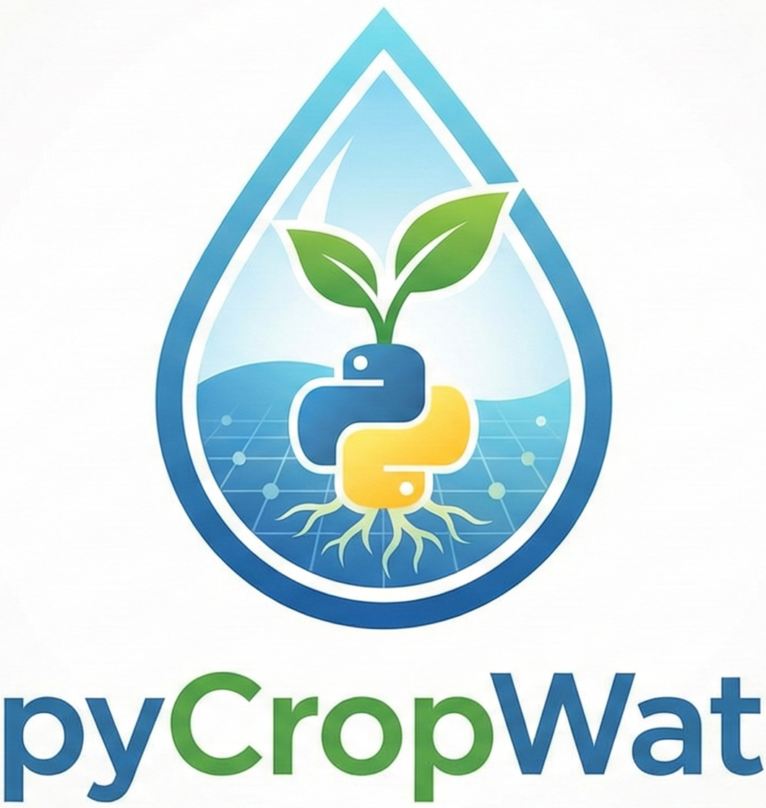<br>
</p>

[](https://github.com/montimaj/pyCropWat/releases)
[](https://pypi.org/project/pycropwat/)
[](https://pepy.tech/project/pycropwat)
[](https://doi.org/10.5281/zenodo.18201620)
[](https://github.com/montimaj/pyCropWat/stargazers)
[](https://montimaj.github.io/pyCropWat)
[](https://opensource.org/licenses/MIT)
[](https://www.python.org/downloads/)

<p align="center">
  
</p>

## Quick Install

```bash
pip install pycropwat
```

## Overview

pyCropWat is a Python package that calculates effective precipitation using multiple methodologies from any Google Earth Engine (GEE) climate dataset. It supports:

- **Multiple GEE datasets**: Any ImageCollection from the [GEE Data Catalog](https://developers.google.com/earth-engine/datasets) or [Community Catalog](https://gee-community-catalog.org/) (e.g., ERA5-Land, TerraClimate, CHIRPS, GPM IMERG)
- **Multiple Peff methods**: CROPWAT, FAO/AGLW, Fixed Percentage, Dependable Rainfall, FarmWest, USDA-SCS, TAGEM-SuET, Ensemble
- **Flexible geometry inputs**: Shapefiles, GeoJSON, or GEE FeatureCollection assets
- **Automatic chunked downloads**: Handles large regions that exceed GEE pixel limits
- **Temporal aggregation**: Annual, seasonal, growing season (with cross-year support for Southern Hemisphere), climatology
- **Statistical analysis**: Anomaly detection, trend analysis, zonal statistics
- **Visualization**: Time series, maps, interactive HTML maps, dataset comparison
- **Export options**: NetCDF, Cloud-Optimized GeoTIFFs
- **Parallel processing**: Uses Dask for efficient multi-month processing
- **CLI and Python API**: Use from command line or integrate into your workflows

## CROPWAT Formula

The CROPWAT method calculates effective precipitation ([Smith, 1992](https://www.fao.org/sustainable-development-goals-helpdesk/champion/article-detail/cropwat/en); [Muratoglu et al., 2023](https://doi.org/10.1016/j.watres.2023.120011)):

$$
P_{eff} = \begin{cases}
P \times \frac{125 - 0.2P}{125} & \text{if } P \leq 250 \text{ mm} \\
0.1P + 125 & \text{if } P > 250 \text{ mm}
\end{cases}
$$

## Effective Precipitation Methods

pyCropWat supports eight different methods for calculating effective precipitation:

### 1. CROPWAT

The method used in FAO CROPWAT software. This is the most widely used method for irrigation planning.

| Condition | Formula |
|-----------|---------|
| P ≤ 250 mm | $P_{eff} = P \times \frac{125 - 0.2P}{125}$ |
| P > 250 mm | $P_{eff} = 0.1P + 125$ |

**Usage:**
```python
ep = EffectivePrecipitation(..., method='cropwat')
```

**Reference:** Smith, M. (1992). *CROPWAT: A computer program for irrigation planning and management*. FAO Irrigation and Drainage Paper No. 46.

---

### 2. FAO/AGLW (Dependable Rainfall)

The FAO Land and Water Division (AGLW) Dependable Rainfall formula, based on 80% probability exceedance, from FAO Irrigation and Drainage Paper No. 33.

| Condition | Formula |
|-----------|---------|
| P ≤ 70 mm | $P_{eff} = \max(0.6P - 10, 0)$ |
| P > 70 mm | $P_{eff} = 0.8P - 24$ |

**Usage:**
```python
ep = EffectivePrecipitation(..., method='fao_aglw')
```

**Reference:** FAO. (1986). *Yield response to water*. FAO Irrigation and Drainage Paper No. 33.

---

### 3. Fixed Percentage

A simple method that assumes a constant fraction of precipitation is effective. Common values range from 70-80%.

$$P_{eff} = P \times f$$

Where $f$ is the effectiveness fraction (default: 0.7 or 70%).

**Usage:**
```python
ep = EffectivePrecipitation(..., method='fixed_percentage', method_params={'percentage': 0.7})
```

---

### 4. Dependable Rainfall

The FAO Dependable Rainfall method is the same as the FAO/AGLW method, based on 80% probability exceedance. It estimates the amount of rainfall that can be depended upon at a given probability level.

| Condition | Formula (at 80% probability) |
|-----------|------------------------------|
| P ≤ 70 mm | $P_{eff} = \max(0.6P - 10, 0)$ |
| P > 70 mm | $P_{eff} = 0.8P - 24$ |

A probability scaling factor is applied for other probability levels:
- 50% probability: ~1.3× base estimate
- 80% probability: 1.0× base estimate (default)
- 90% probability: ~0.9× base estimate

**Usage:**
```python
ep = EffectivePrecipitation(..., method='dependable_rainfall', method_params={'probability': 0.80})
```

**Reference:** FAO. (1992). *CROPWAT - A computer program for irrigation planning and management*. FAO Irrigation and Drainage Paper No. 46.

---

### 5. FarmWest

A simple empirical formula used by [FarmWest program](https://farmwest.com/climate/calculator-information/et/effective-precipitation/) for irrigation scheduling in the Pacific Northwest.

$$P_{eff} = \max((P - 5) \times 0.75, 0)$$

The method assumes the first 5 mm is lost to interception/evaporation, and 75% of the remaining precipitation is effective.

**Usage:**
```python
ep = EffectivePrecipitation(..., method='farmwest')
```

**Reference:** FarmWest. [Effective Precipitation](https://farmwest.com/climate/calculator-information/et/effective-precipitation/).

---

### 6. USDA-SCS (with AWC and ETo)

The USDA Soil Conservation Service method that accounts for soil water holding capacity (AWC) and reference evapotranspiration (ETo). This method is more site-specific than other methods.

**Formula:**

1. Soil storage depth: $d = AWC \times 0.5 \times D_{root}$ (in inches)
2. Storage factor: $sf = 0.531747 + 0.295164 \cdot d - 0.057697 \cdot d^2 + 0.003804 \cdot d^3$
3. Effective precipitation: $P_{eff} = sf \times (P^{0.82416} \times 0.70917 - 0.11556) \times 10^{ET_o \times 0.02426}$
4. Clamped: $P_{eff} = \min(P_{eff}, P, ET_o)$, $P_{eff} \geq 0$

**Required GEE Assets:**

| Region | AWC Asset | ETo Asset |
|--------|-----------|----------|
| **U.S.** | `projects/openet/soil/ssurgo_AWC_WTA_0to152cm_composite` | `projects/openet/assets/reference_et/conus/gridmet/monthly/v1` |
| **Global** | `projects/sat-io/open-datasets/FAO/HWSD_V2_SMU` | `projects/climate-engine-pro/assets/ce-ag-era5-v2/daily` |

**Usage (CLI - U.S.):**
```bash
pycropwat process --asset ECMWF/ERA5_LAND/MONTHLY_AGGR --band total_precipitation_sum \
    --method usda_scs \
    --awc-asset projects/openet/soil/ssurgo_AWC_WTA_0to152cm_composite \
    --eto-asset projects/openet/assets/reference_et/conus/gridmet/monthly/v1 \
    --eto-band eto --rooting-depth 1.0 ...
```

**Usage (CLI - Global):**
```bash
pycropwat process --asset ECMWF/ERA5_LAND/MONTHLY_AGGR --band total_precipitation_sum \
    --method usda_scs \
    --awc-asset projects/sat-io/open-datasets/FAO/HWSD_V2_SMU --awc-band AWC \
    --eto-asset projects/climate-engine-pro/assets/ce-ag-era5-v2/daily \
    --eto-band ReferenceET_PenmanMonteith_FAO56 --eto-is-daily \
    --rooting-depth 1.0 ...
```

**Reference:** USDA SCS. (1993). [Chapter 2 Irrigation Water Requirements](https://www.wcc.nrcs.usda.gov/ftpref/wntsc/waterMgt/irrigation/NEH15/ch2.pdf). In Part 623 National Engineering Handbook. USDA Soil Conservation Service.

---

### 7. TAGEM-SuET (with ETo)

The TAGEM-SuET (Türkiye'de Sulanan Bitkilerin Bitki Su Tüketimleri - Turkish Irrigation Management and Plant Water Consumption System) method calculates effective precipitation based on the difference between precipitation and reference evapotranspiration. When precipitation exceeds ETo, the excess becomes effective precipitation.

**Formula:**

$$
P_{eff} = \begin{cases}
0 & \text{if } P \leq ET_o \\
P - ET_o & \text{if } P > ET_o \text{ and } (P - ET_o) < 75 \\
75 + 0.0011(P - ET_o - 75)^2 + 0.44(P - ET_o - 75) & \text{otherwise}
\end{cases}
$$

!!! warning "Performance Note"
    Studies have shown that the TAGEM-SuET method tends to underperform compared to other methods, particularly in arid and semi-arid climates where ETo often exceeds precipitation. In our method comparison analyses, TAGEM-SuET consistently produced the lowest effective precipitation estimates. Users should consider this limitation when selecting a method for their application.

**Reference:** [Muratoglu, A., Bilgen, G. K., Angin, I., & Kodal, S. (2023). Performance analyses of effective rainfall estimation methods for accurate quantification of agricultural water footprint. *Water Research*, 238, 120011.](https://doi.org/10.1016/j.watres.2023.120011)

**Usage:**
```python
ep = EffectivePrecipitation(..., method='suet', method_params={
    'eto_asset': 'projects/openet/assets/reference_et/conus/gridmet/monthly/v1',
    'eto_band': 'eto'
})
```

**Usage (CLI):**
```bash
pycropwat process --asset ECMWF/ERA5_LAND/MONTHLY_AGGR --band total_precipitation_sum \
    --method suet \
    --eto-asset projects/openet/assets/reference_et/conus/gridmet/monthly/v1 \
    --eto-band eto ...
```

---

### 8. Ensemble - Default (Mean of Methods)

The ensemble method provides a robust estimate by calculating the mean of six methods, excluding TAGEM-SuET which has been shown to underperform in comparative analyses. This multi-method average reduces bias from any single method.

**Included Methods:**

1. CROPWAT - FAO standard method
2. FAO/AGLW - Dependable Rainfall (80% exceedance)
3. Fixed Percentage - 70% of precipitation
4. Dependable Rainfall - 75% probability level
5. FarmWest - Pacific Northwest method
6. USDA-SCS - Soil-based method

**Formula:**

$$P_{eff}^{ensemble} = \frac{P_{eff}^{cropwat} + P_{eff}^{fao\_aglw} + P_{eff}^{fixed} + P_{eff}^{dependable} + P_{eff}^{farmwest} + P_{eff}^{usda\_scs}}{6}$$

!!! info "Recommended Method"
    The ensemble method is recommended when users want a robust, multi-method average that reduces bias from any single method. It requires AWC and ETo assets (same as USDA-SCS) since it internally calculates all component methods.

**Required GEE Assets:** Same as USDA-SCS method (AWC and ETo).

**Usage:**
```python
ep = EffectivePrecipitation(..., method='ensemble', method_params={
    'awc_asset': 'projects/openet/soil/ssurgo_AWC_WTA_0to152cm_composite',
    'awc_band': 'AWC',
    'eto_asset': 'projects/openet/assets/reference_et/conus/gridmet/monthly/v1',
    'eto_band': 'eto',
    'rooting_depth': 1.0
})
```

**Usage (CLI):**
```bash
pycropwat process --asset ECMWF/ERA5_LAND/MONTHLY_AGGR --band total_precipitation_sum \
    --method ensemble \
    --awc-asset projects/openet/soil/ssurgo_AWC_WTA_0to152cm_composite --awc-band AWC \
    --eto-asset projects/openet/assets/reference_et/conus/gridmet/monthly/v1 \
    --eto-band eto --rooting-depth 1.0 ...
```

---

### Method Comparison

| Method | Use Case | Characteristics |
|--------|----------|-----------------|
| **CROPWAT** | General irrigation planning | Balanced, widely validated |
| **FAO/AGLW** | Yield response studies | FAO Dependable Rainfall (80% exceedance) |
| **Fixed Percentage** | Quick estimates, calibration | Simple, requires local calibration |
| **Dependable Rainfall** | Risk-averse planning | Same as FAO/AGLW, with probability scaling |
| **FarmWest** | Pacific Northwest irrigation | Simple, accounts for interception loss |
| **USDA-SCS** | Site-specific irrigation | Accounts for soil AWC and ETo |
| **TAGEM-SuET** | ET-based irrigation planning | Based on P - ETo difference |
| **Ensemble** | Robust multi-method estimate | Mean of 6 methods (excludes TAGEM-SuET) |

!!! tip "Choosing a Method"
    - Use **Ensemble** (default) for robust multi-method estimates when soil and ETo data are available
    - Use **CROPWAT** for most irrigation planning applications when soil data is unavailable
    - Use **FAO/AGLW** or **Dependable Rainfall** when following FAO Irrigation Paper No. 33 guidelines (they use the same base formula)
    - Use **Fixed Percentage** when you have locally calibrated effectiveness values
    - Use **FarmWest** for Pacific Northwest regions or when accounting for interception loss
    - Use **USDA-SCS** when soil AWC and ETo data are available for site-specific estimates
    - Use **TAGEM-SuET** with caution - this method tends to produce the lowest Peff estimates and may underperform in arid/semi-arid regions (see [Muratoglu et al., 2023](https://doi.org/10.1016/j.watres.2023.120011))

## Quick Start

### CLI

```bash
# Install (basic)
pip install pycropwat

# Or with interactive map support
pip install pycropwat[interactive]

# Process effective precipitation
pycropwat process \
    --asset ECMWF/ERA5_LAND/MONTHLY_AGGR \
    --band total_precipitation_sum \
    --gee-geometry projects/my-project/assets/study_area \
    --start-year 2020 --end-year 2023 \
    --scale-factor 1000 \
    --output ./outputs

# Create annual aggregation
pycropwat aggregate --input ./outputs --type annual --year 2020 \
    --output ./annual_2020.tif

# Generate time series plot
pycropwat plot timeseries --input ./outputs \
    --start-year 2020 --end-year 2023 --output ./timeseries.png
```

### Python

```python
from pycropwat import EffectivePrecipitation
from pycropwat.analysis import TemporalAggregator, Visualizer

# Process effective precipitation
ep = EffectivePrecipitation(
    asset_id='ECMWF/ERA5_LAND/MONTHLY_AGGR',
    precip_band='total_precipitation_sum',
    gee_geometry_asset='projects/my-project/assets/study_area',
    start_year=2020,
    end_year=2023,
    precip_scale_factor=1000
)
ep.process(output_dir='./outputs', n_workers=4)

# Create annual aggregation
agg = TemporalAggregator('./outputs')
agg.annual_aggregate(2020, output_path='./annual_2020.tif')

# Generate time series plot
viz = Visualizer('./outputs')
viz.plot_time_series(2020, 2023, output_path='./timeseries.png')
```

## Features

### ✅ Implemented

- 📊 **Multiple Peff methods**: CROPWAT, FAO/AGLW, Fixed Percentage, Dependable Rainfall, FarmWest, USDA-SCS, TAGEM-SuET
- 🗓️ **Temporal aggregation**: Annual, seasonal, growing season (with cross-year support), climatology
- 📈 **Statistical analysis**: Anomaly detection, trend analysis (linear, Theil-Sen), zonal statistics
- 📉 **Visualization**: Time series, climatology charts, maps, interactive HTML maps, dataset comparison (side-by-side, scatter, annual)
- 📤 **Export options**: NetCDF with time dimension, Cloud-Optimized GeoTIFFs
- 🌍 **Any GEE climate dataset** with precipitation band
- 🗺️ **Flexible resolution control** (native or custom scale)
- ⚡ **Parallel processing** with Dask
- 🧩 **Automatic tiling** for large regions (in-memory mosaicking)

### 🚧 Planned

- 🌾 **Crop water requirements**: Kc integration, net irrigation requirement
- 📈 **Advanced analysis**: Drought indices (SPI, SPEI), direct cloud export
- ✅ **Validation tools**: Station comparison, uncertainty quantification
- 💧 **Water balance**: ET integration, simple water balance

## Example Outputs

The following visualizations are generated by the [complete workflow example](examples.md#example-12-complete-workflow) using real Rio de la Plata basin data:

### Time Series & Climatology

<p align="center">
  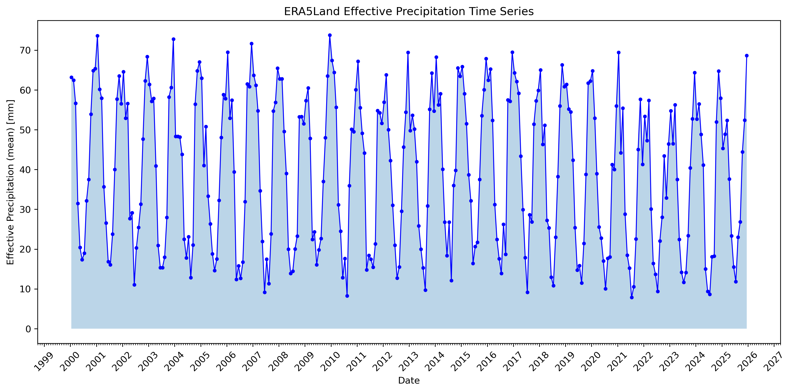
  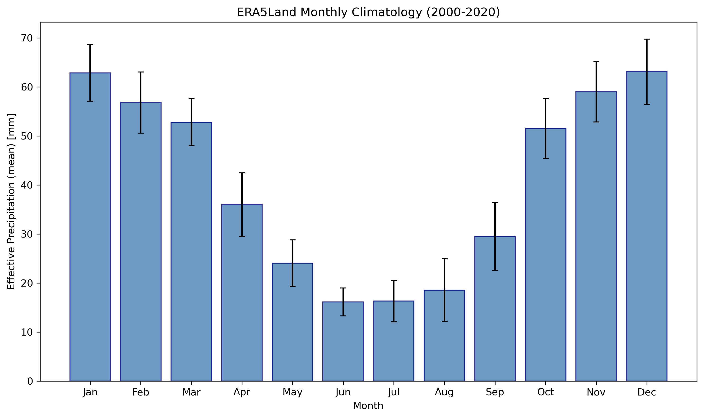
</p>

*Left: Monthly effective precipitation time series (2000-2025). Right: Monthly climatology showing seasonal patterns.*

### Spatial Maps

<p align="center">
  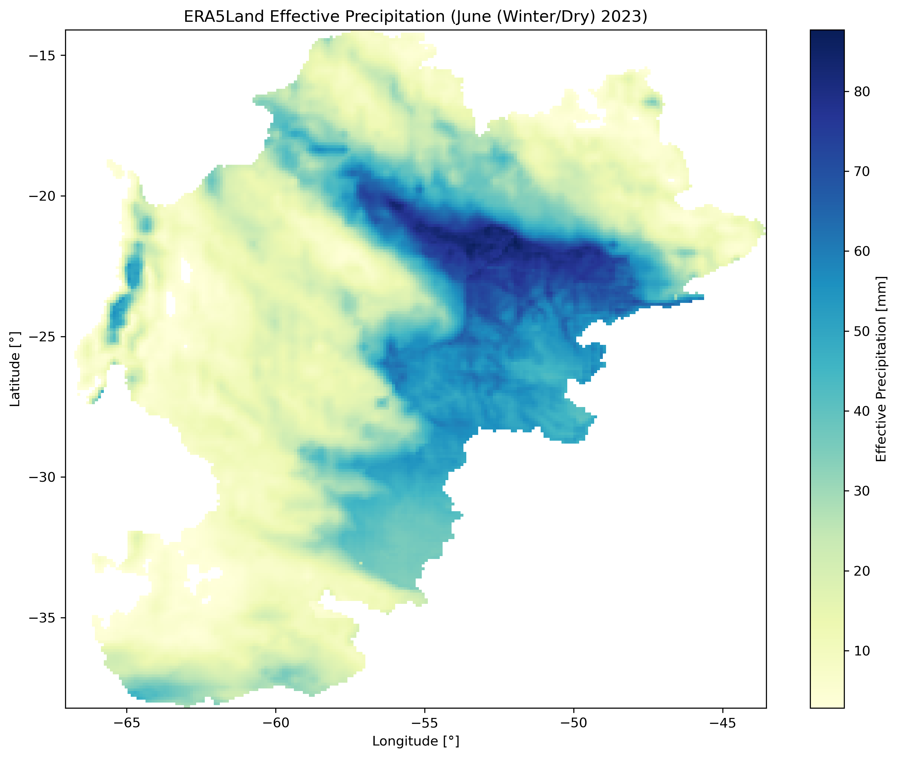
  
  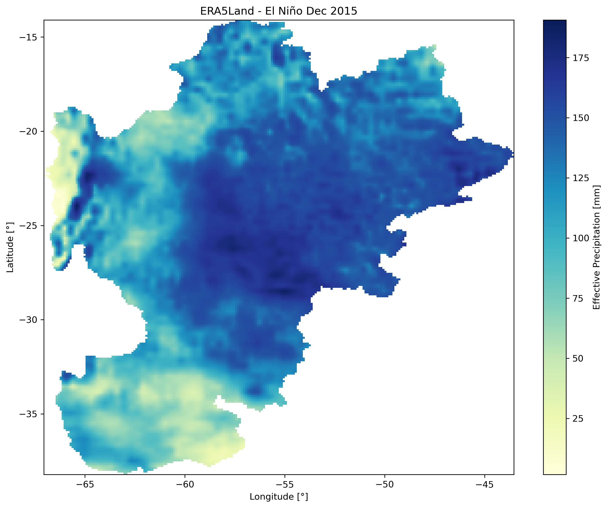
</p>

*Left: Winter dry season (June 2023). Center: Summer wet season (January 2023). Right: El Niño event (December 2015).*

### Dataset Comparison (ERA5-Land vs TerraClimate)

<p align="center">
  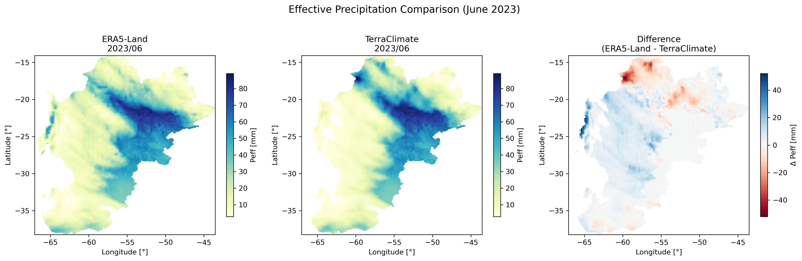
</p>

*Side-by-side comparison of ERA5-Land and TerraClimate effective precipitation with difference map.*

<p align="center">
  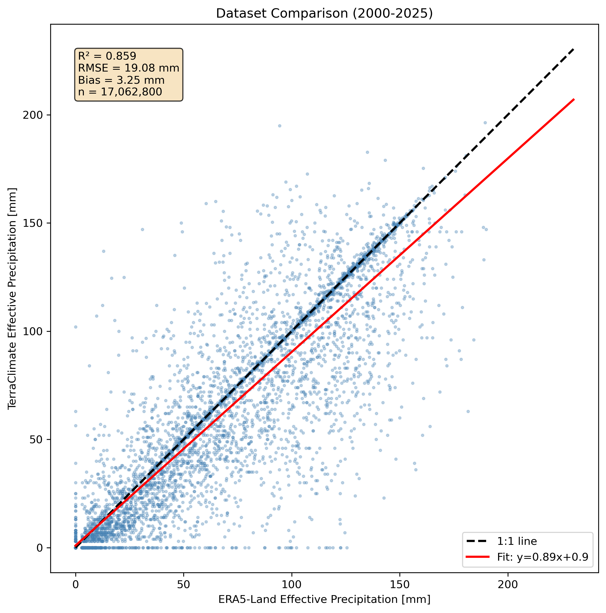
  
</p>

*Left: Scatter plot comparison with R², RMSE, and bias statistics. Right: Annual totals comparison.*

### Method Comparison

<p align="center">
  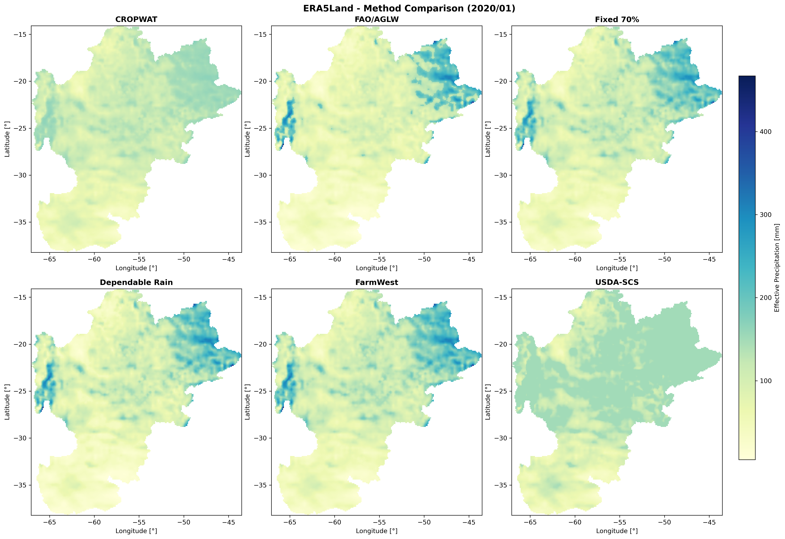
</p>

*Comparison of all 8 effective precipitation methods: CROPWAT, FAO/AGLW, Fixed Percentage (70%), Dependable Rainfall (80%), FarmWest, USDA-SCS, TAGEM-SuET, and Ensemble.*

<p align="center">
  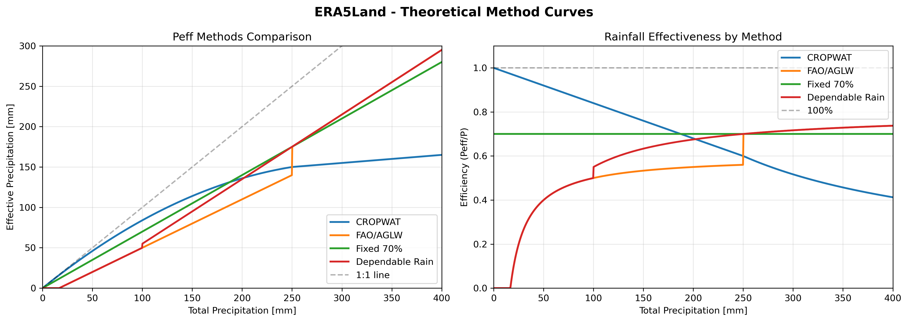
</p>

*Theoretical response curves for different effective precipitation methods.*

### Anomaly, Climatology & Trend Maps

<p align="center">
  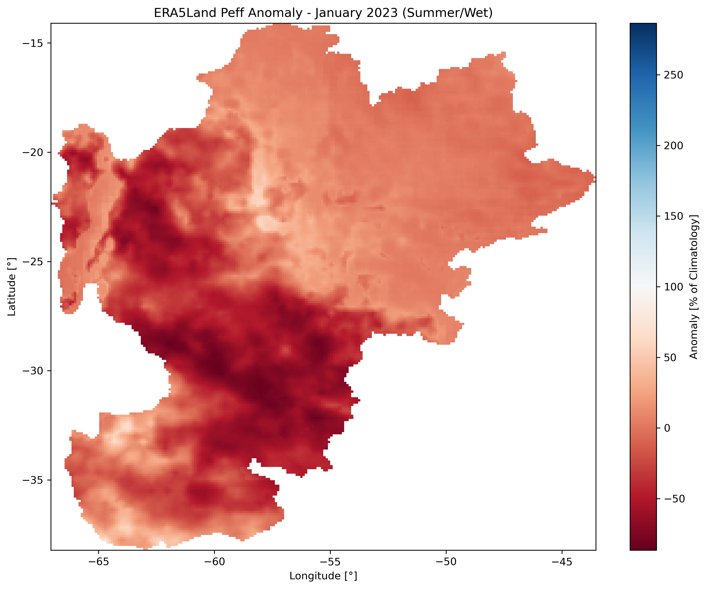
  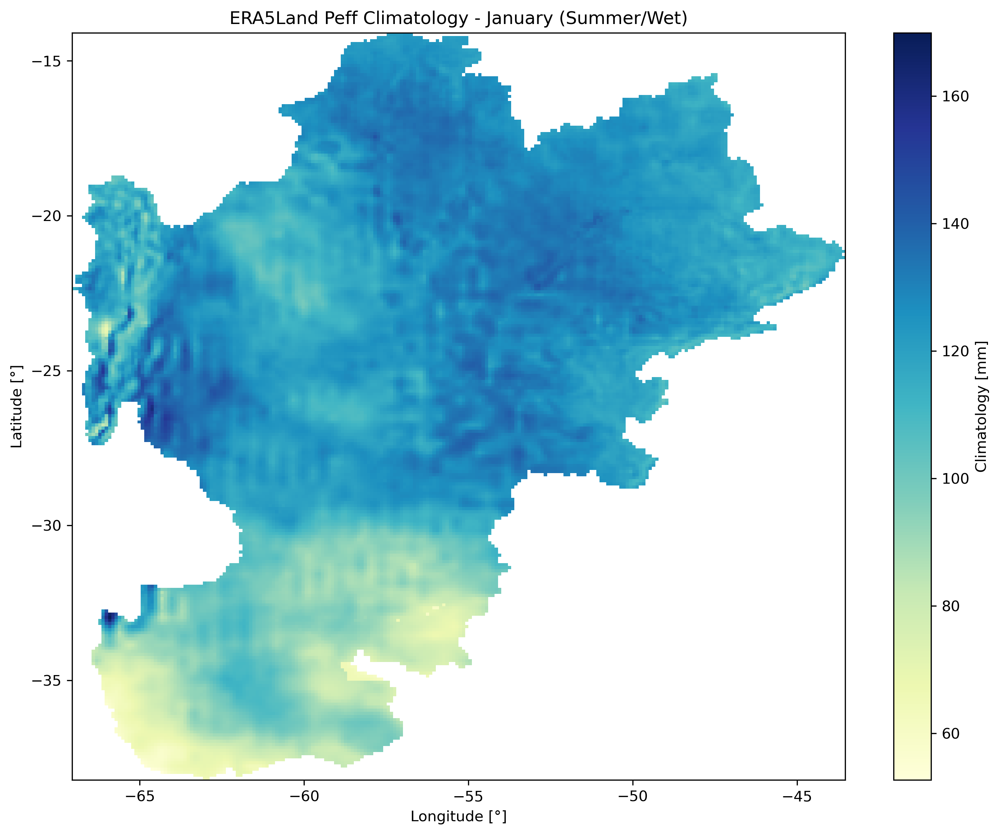
  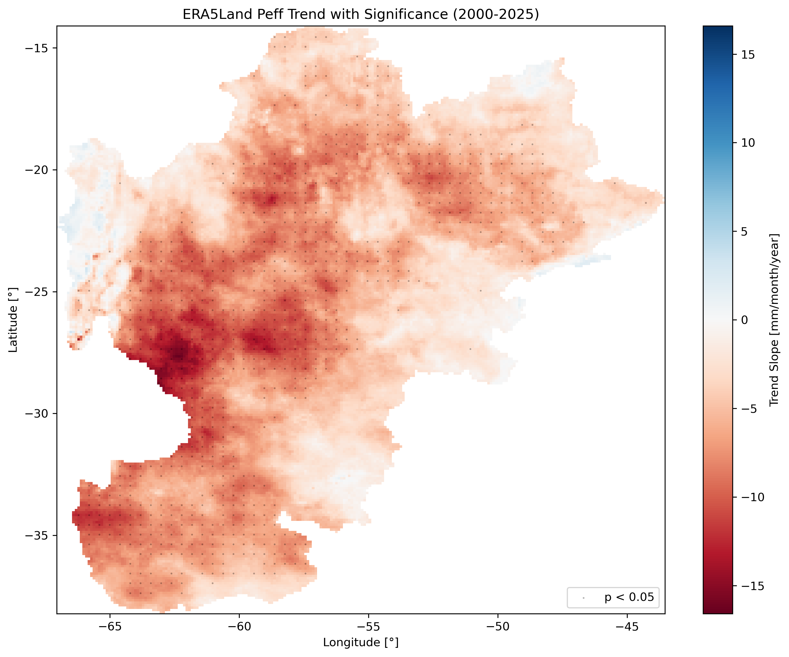
</p>

*Left: Percent anomaly (January 2023). Center: January climatology (2000-2020). Right: Long-term trend with significance stippling (p < 0.05).*

---

### Arizona Example (USDA-SCS Method)

The [Arizona workflow](examples.md#arizona-usda-scs-example) demonstrates U.S.-specific datasets with the USDA-SCS method:

<p align="center">
  
  
</p>

*GridMET USDA-SCS effective precipitation for Arizona: time series (left) and monthly climatology (right).*

<p align="center">
  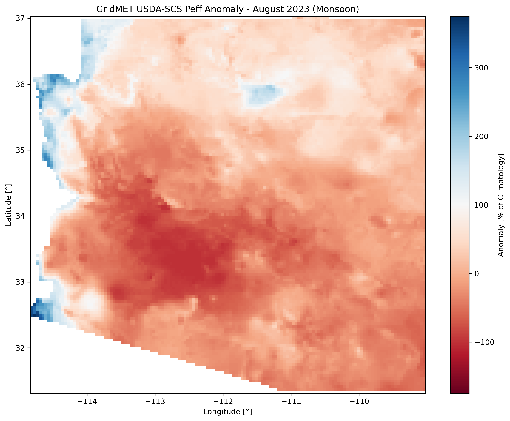
  
  
</p>

*Left: August 2023 anomaly (monsoon). Center: August climatology. Right: Long-term trend with significance stippling.*

### New Mexico Example (8-Method Comparison)

The [New Mexico workflow](examples.md#example-12-new-mexico-prism-workflow) compares all 8 effective precipitation methods using PRISM data:

<p align="center">
  
</p>

*Mean annual effective precipitation (1986-2025) for all 8 methods: CROPWAT, FAO/AGLW, Fixed 70%, Dependable Rainfall, FarmWest, USDA-SCS, TAGEM-SuET, and Ensemble.*

<p align="center">
  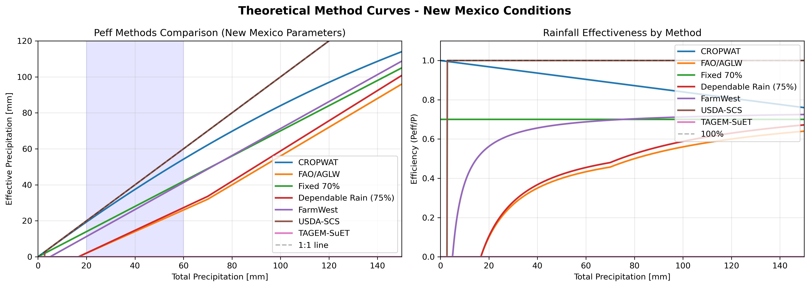
</p>

*Theoretical response curves for all 8 effective precipitation methods using New Mexico typical values (AWC=120mm/m, ETo=200mm/month).*

## Documentation

For full documentation, visit [https://montimaj.github.io/pyCropWat](https://montimaj.github.io/pyCropWat)

- [Quick Start Guide](user-guide/quickstart.md)
- [CLI Reference](user-guide/cli.md)
- [Python API](user-guide/api.md)
- [Examples](examples.md)
- [Complete Workflow Example](examples.md#example-12-complete-workflow) - A comprehensive script demonstrating all features

!!! tip "Try the Complete Workflow Examples"
    The `Examples/` directory provides ready-to-run demonstrations:
    
    **Rio de la Plata Example (Global datasets):**
    ```bash
    # Full workflow with GEE processing (generates ~5 GB of output data)
    python Examples/south_america_example.py --gee-project your-project-id --workers 8
    
    # Analysis only (requires previously generated data)
    python Examples/south_america_example.py --analysis-only
    ```
    
    **Arizona USDA-SCS Example (U.S. datasets):**
    ```bash
    # Full workflow with GEE processing (generates ~12 GB of output data)
    python Examples/arizona_example.py --gee-project your-project-id --workers 8
    
    # Analysis only (requires previously generated data)
    python Examples/arizona_example.py --analysis-only
    ```
    
    **New Mexico 8-Method Comparison:**
    ```bash
    # Full workflow with GEE processing (generates ~14 GB of output data)
    python Examples/new_mexico_example.py --gee-project your-project-id --workers 8
    ```

## U.S.-Specific Datasets

For U.S.-based applications, pyCropWat supports high-resolution precipitation and the USDA-SCS method:

### Precipitation Datasets

| Dataset | Asset ID | Band | Resolution |
|---------|----------|------|------------|
| **GridMET** | `IDAHO_EPSCOR/GRIDMET` | `pr` | ~4 km |
| **PRISM** | `projects/sat-io/open-datasets/OREGONSTATE/PRISM_800_MONTHLY` | `ppt` | ~800 m |

### USDA-SCS Required Assets

| Dataset | Asset ID | Band | Description |
|---------|----------|------|-------------|
| **AWC (SSURGO)** | `projects/openet/soil/ssurgo_AWC_WTA_0to152cm_composite` | (single) | USDA SSURGO soil data |
| **ETo (GridMET)** | `projects/openet/assets/reference_et/conus/gridmet/monthly/v1` | `eto` | OpenET GridMET monthly ETo |

### Example: Arizona with USDA-SCS

```bash
pycropwat process --asset IDAHO_EPSCOR/GRIDMET --band pr \
    --gee-geometry users/montimajumdar/AZ \
    --start-year 2000 --end-year 2024 --scale 4000 \
    --method usda_scs \
    --awc-asset projects/openet/soil/ssurgo_AWC_WTA_0to152cm_composite \
    --eto-asset projects/openet/assets/reference_et/conus/gridmet/monthly/v1 \
    --eto-band eto --rooting-depth 1.0 \
    --output ./AZ_GridMET_USDA_SCS
```

See [Examples](examples.md#arizona-usda-scs-example) for the complete Arizona workflow script.

## Citation

If you use pyCropWat in your research, please cite:

```bibtex
@software{pycropwat,
  author = {Majumdar, Sayantan and ReVelle, Peter and Pearson, Christopher and Nozari, Soheil and Huntington, Justin L. and Smith, Ryan G.},
  title = {pyCropWat: A Python Package for Computing Effective Precipitation Using Google Earth Engine Climate Data},
  year = {2026},
  url = {https://github.com/montimaj/pyCropWat},
  doi = {10.5281/zenodo.18201620}
}
```

### Effective Precipitation Method References

- Muratoglu, A., Bilgen, G. K., Angin, I., & Kodal, S. (2023). Performance analyses of effective rainfall estimation methods for accurate quantification of agricultural water footprint. *Water Research*, *238*, 120011. [https://doi.org/10.1016/j.watres.2023.120011](https://doi.org/10.1016/j.watres.2023.120011)

- Smith, M. (1992). *CROPWAT: A computer program for irrigation planning and management* (FAO Irrigation and Drainage Paper No. 46). Food and Agriculture Organization of the United Nations. [https://www.fao.org/sustainable-development-goals-helpdesk/champion/article-detail/cropwat/en](https://www.fao.org/sustainable-development-goals-helpdesk/champion/article-detail/cropwat/en)

- USDA SCS. (1993). Chapter 2 Irrigation Water Requirements. In Part 623 National Engineering Handbook. USDA Soil Conservation Service. [https://www.wcc.nrcs.usda.gov/ftpref/wntsc/waterMgt/irrigation/NEH15/ch2.pdf](https://www.wcc.nrcs.usda.gov/ftpref/wntsc/waterMgt/irrigation/NEH15/ch2.pdf)

## Funding

This work was supported by a U.S. Army Corps of Engineers grant (W912HZ25C0016) for the project *"Improved Characterization of Groundwater Resources in Transboundary Watersheds using Satellite Data and Integrated Models."*

**Principal Investigator:** Dr. Ryan Smith (Colorado State University)

**Co-Principal Investigators:**

- Dr. Ryan Bailey (Colorado State University)
- Dr. Justin Huntington (Desert Research Institute)
- Dr. Sayantan Majumdar (Desert Research Institute)
- Mr. Peter ReVelle (Desert Research Institute)

**Research Scientist:**

- Dr. Soheil Nozari (Colorado State University)

## License

MIT License - see [LICENSE](LICENSE) for details.